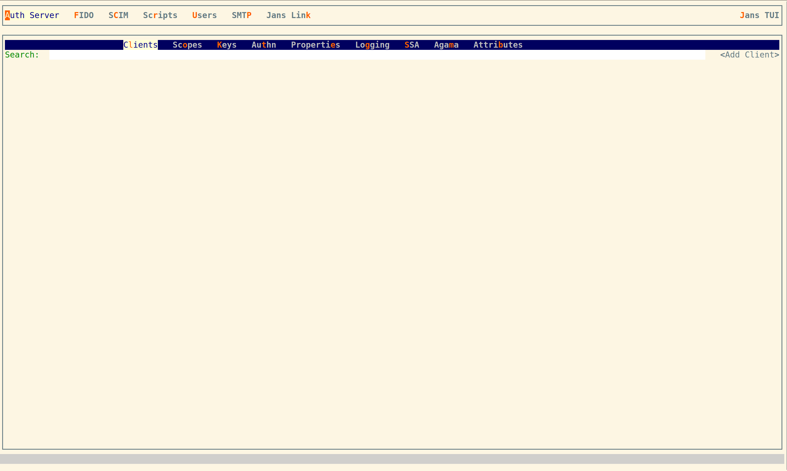
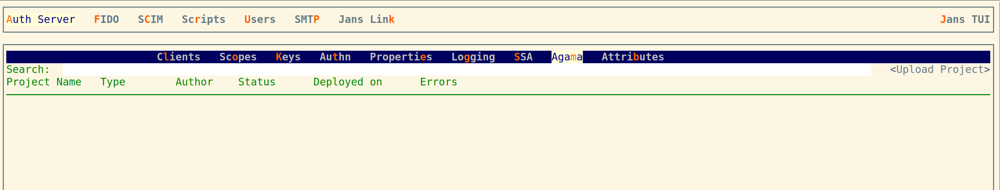
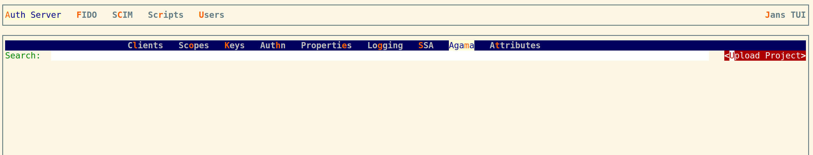
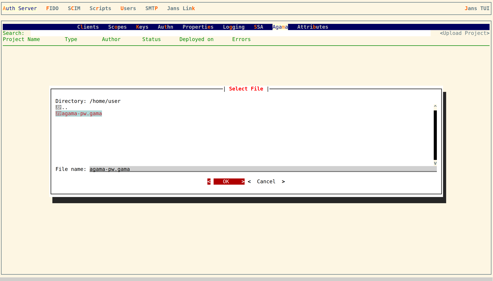
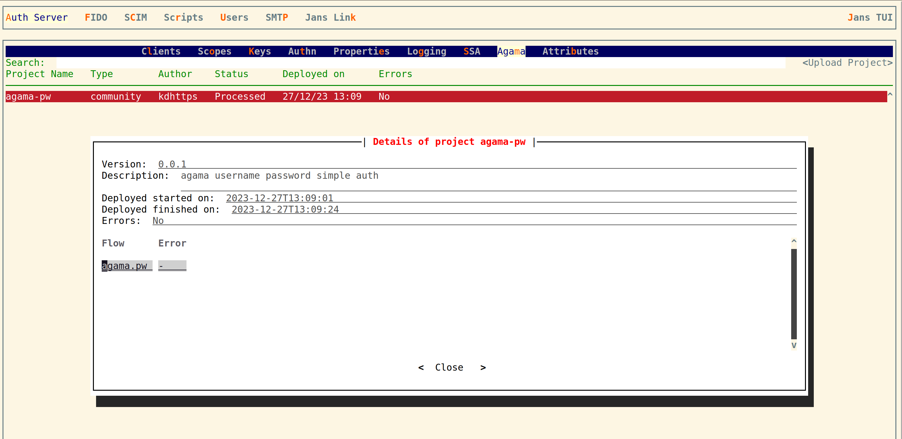
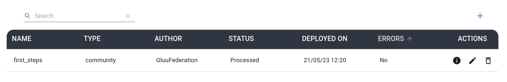

# Deploying an Agama project to Jans Server


This page provides steps to deploy a project to your Jans Server. Ensure you have your gama file at hand and the server location where your Jans Server is reachable, e.g. https://myjans.acme.co.

## Using TUI

Follow the steps in this section if you don't have a Gluu Flex installation with admin-UI. Note some command line administration skills are required:

- Upload the gama file to a temporary location in your server. Use SFTP/SCP for this purpose

- Login to your server using SSH and execute this command
  ```
  python3 /opt/jans/jans-cli/jans_cli_tui.py
  ```
- A terminal-based user interface will appear, follow the steps to get access
  

- Enter to the Agama menu (press `Alt + m`)
  

- Tab to highlight the `Upload` project button, press `Enter` and select the gama file you previously copied to your server. A new row will appear in the table.
  

  Select a gama file and upload
  

- After one minute, check the deployment details to verify the deployment was successful: highlight (using tab) the project's row and press `d` in your keyboard.

  

## Using Flex admin-UI

In your browser, access the graphical administration console, e.g. https://myjans.acme.co/admin.

Ensure the Agama engine is enabled: In the left menu browse to `Auth server > Configuration > Properties`. Scroll down to the Agama configuration section, and turn on the `enabled` switch.

Navigate to `Auth server > Agama`, and click on the plus icon. In the emergent dialog upload the gama file corresponding to the project you want to deploy as well as the accompanying sha256 file. Once upload completes, the deployments table will populate with a new row. After one minute, click on the information icon in the Actions column to verify the deployment was successful.


