## Publish Agama Project and register to the explore catalog

You need it only when you are planning to add your project to explore catalog so that community can use your agama flow and add your security rules easily.

Your agama flow code always be in public repository. As per all usecases of repositories there are 3 repository category which you will have during publish project process.

### 1. Pre-released Repository

When you create a new repository and open it in Agama-Lab then it will be automatically consider as a `Pre-released` repository. This is just your general development repository. which can hold multiple agama projects and has `ads.json`. You cannot register this repository on explore-catalog because it may holds multiple projects.

### 2. Published Repository

In order to publish a project, the user is required to create an empty repository on GitHub. After published, this repository only have one dedicated project and has `project.json`. You can easily register this repository to explore-catalog section.

| Pre-released                                | Published                                |
| ------------------------------------------- | ---------------------------------------- |
| Holds many projects                         | Holds one project                        |
| Development                                 | Production                               |
| Cannot be registered on the Explore catalog | Can be registered on the Explore catalog |
| Cannot be forked                            | Can be forked                            |

### Publish Project Steps

#### Step-1

In order to publish a project, the user is required to create an empty repository on GitHub. The initial specifications for the new repository include:

- A repository description.
- The repository must be set to public visibility.
- An initial commit is mandatory; the user can achieve this by initializing the repository and adding a `README.md` file.
- The default branch for the repository must be named `main`.
- Add `topics` after you created repository.

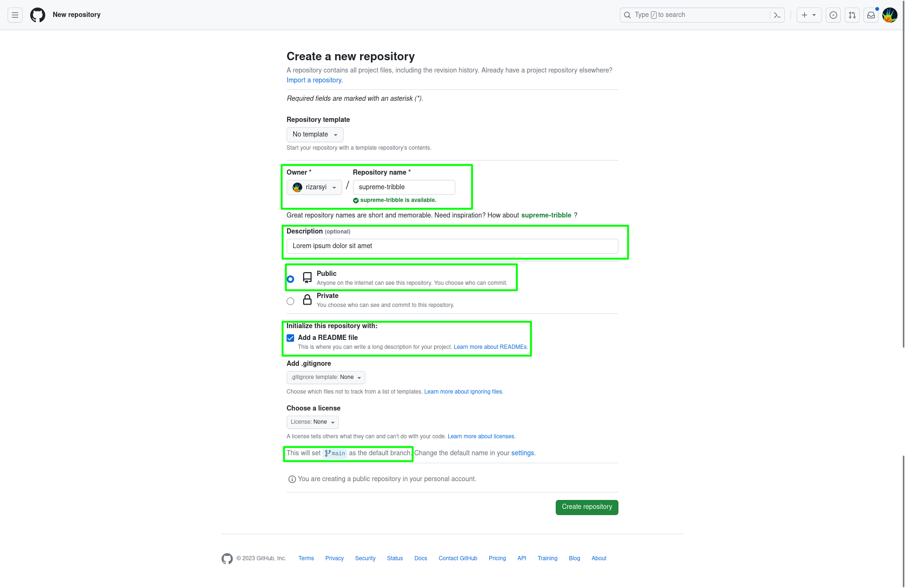

#### Step-2

Open your already developer agama project in agama-lab. It will be your pre-release repository.

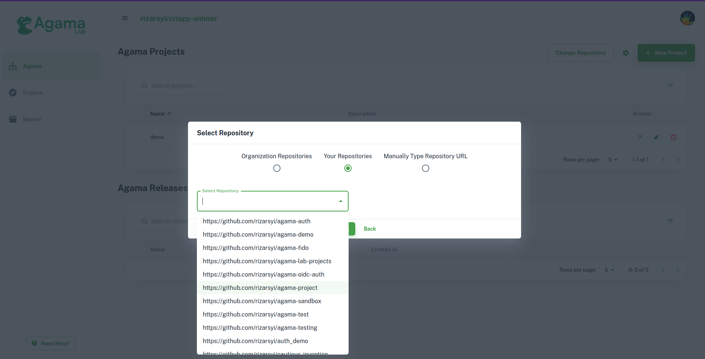

Navigate to project details page.

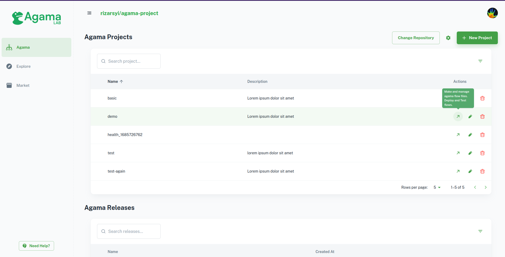

#### Step-3

To initiate the project publishing process, right-click on the file explorer and choose the `Publish Project` option.

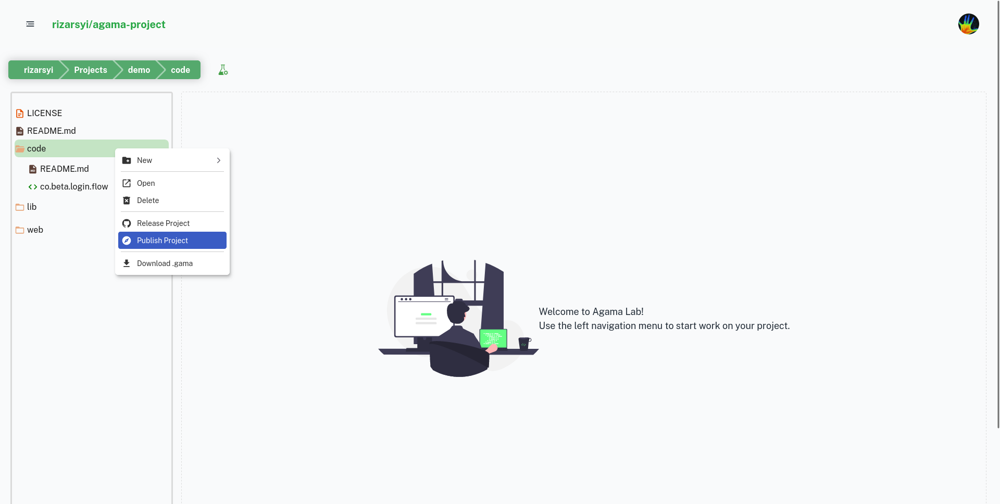

Upon selecting the `Publish Project` option, a publish form dialog will appear. The user is required to input the release version and the URL of the target repository, which, in this case, is the repository that the user has just created.

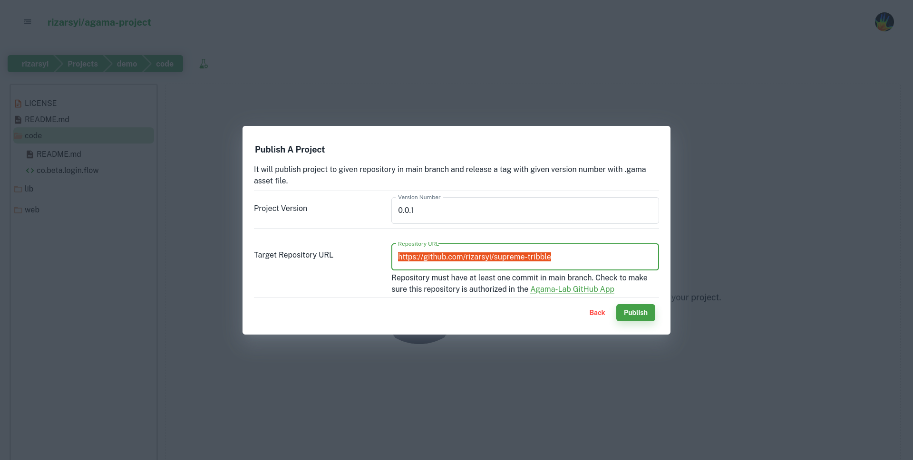

Subsequently, click on the `Publish` button. The system will proceed to push the project contents into the target repository, generating an initial release version according to the provided input.

Result of the Published Repository:

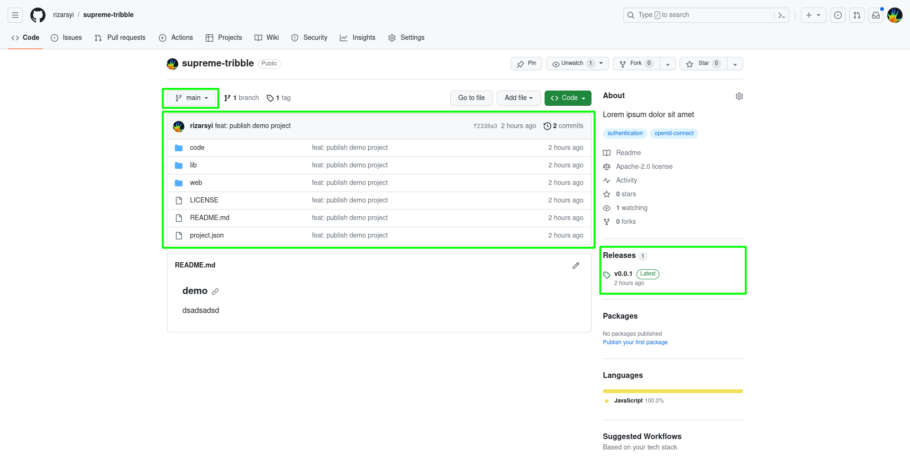

### Register the published repository to the Explore catalog

The Explore Catalog Registration is a feature designed to register a published project/repository in the Explore catalog.

#### Step-1

Access the `Explore` page by clicking on the Explore menu in the sidebar.

Subsequently, click on the `Add Project` button. This action will prompt the display of the wizard form registration dialog.

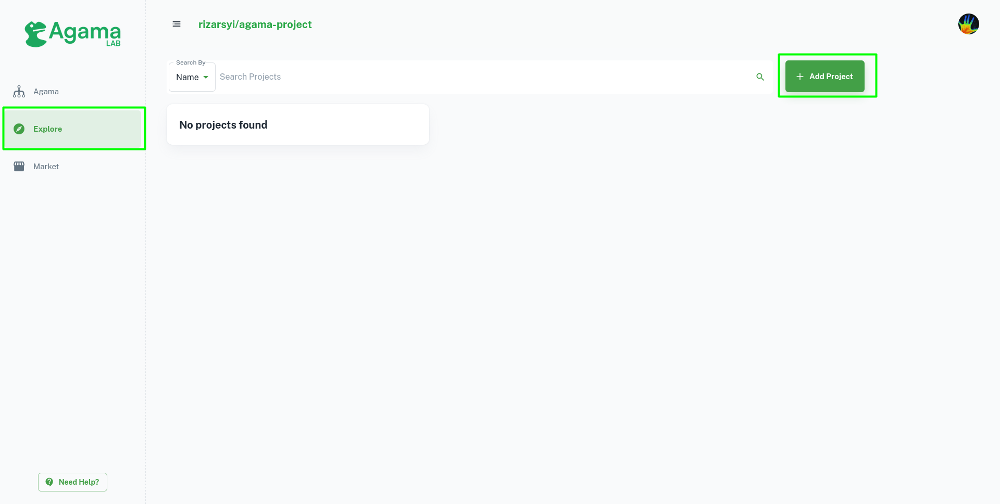

#### Step-2

Click on the repository selection input; a loader will appear, indicating that it is awaiting the retrieval of user repository data. Proceed by searching for the repository by its name.

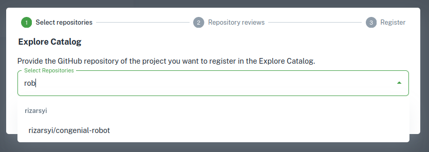

Click `Next` to advance to the next step. The system will provide feedback to the user regarding the selected repository.

In case the feedback indicates errors, such as missing descriptions for the repository, the user can address and resolve these issues directly on the GitHub repository.

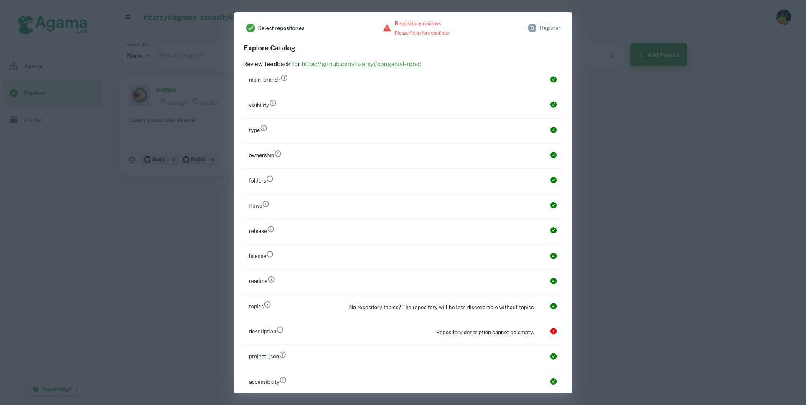

An example of rectifying feedback errors involves addressing the issue of missing topics directly on the GitHub repository. Click on the repository link, and it will open the selected repository in a new tab.

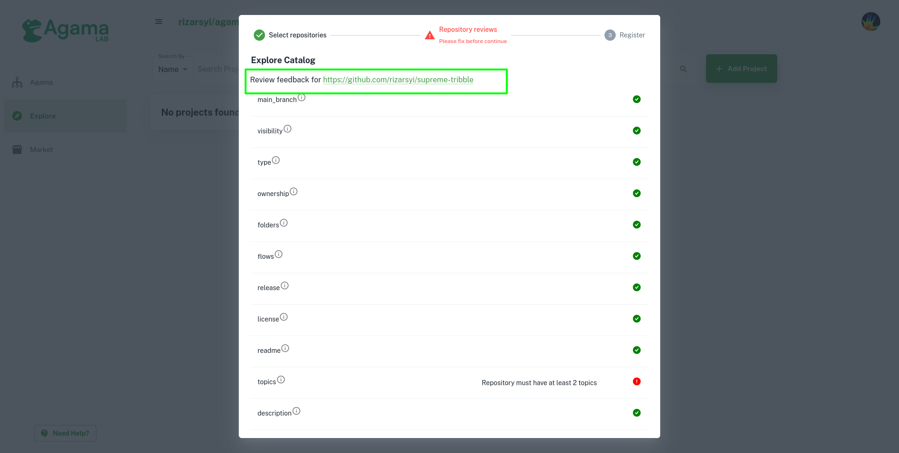

To add repository descriptions, click on the gear icon located in the About section. This action will open the repository details dialog.

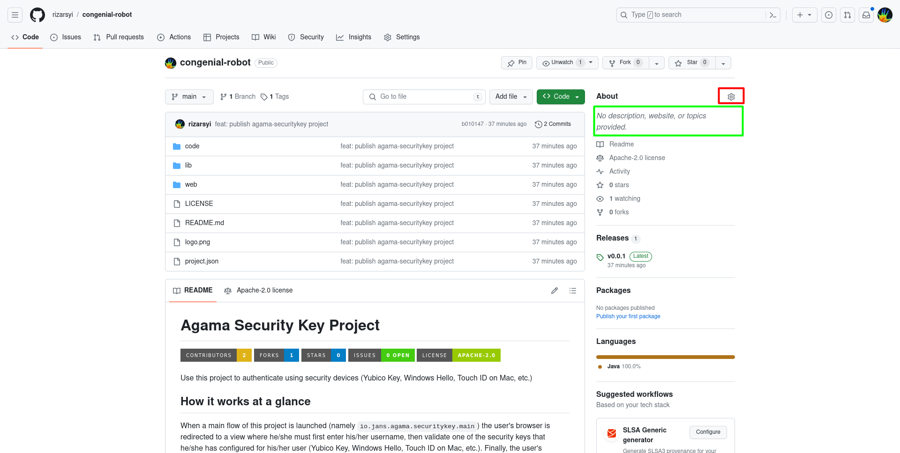

Fill in the description in the Edit Repository Details form. Subsequently, click on the Save Changes button to save the modifications.

Return to the Agama-lab application, and click on the Refresh button. This action will re-validate the repository.

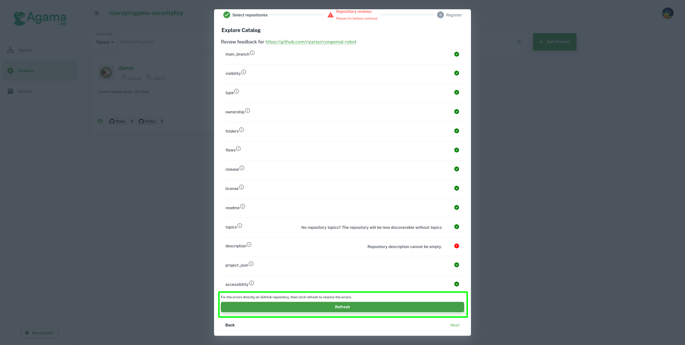

If the feedback indicates no errors, you can proceed to the next step.

#### Step-3

This step allows the user to review and upload a custom logo before registering the repository in the Explore catalog. After the review, click `Finish`, and the system will initiate the process of registering the project in the Agama-lab Explore catalog.

> The system will generate the logo for the user if the logo is not uploaded

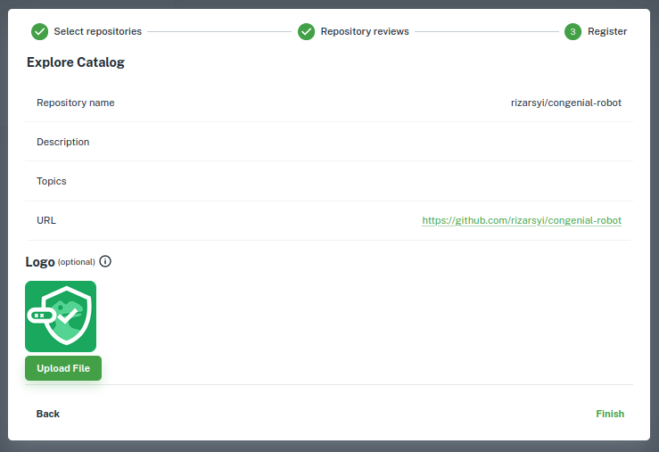

A success message will be displayed and the system will notify the Agama-Lab team to review the submitted repository, once approved the project will be visible in the Agama-Lab Explore catalog.

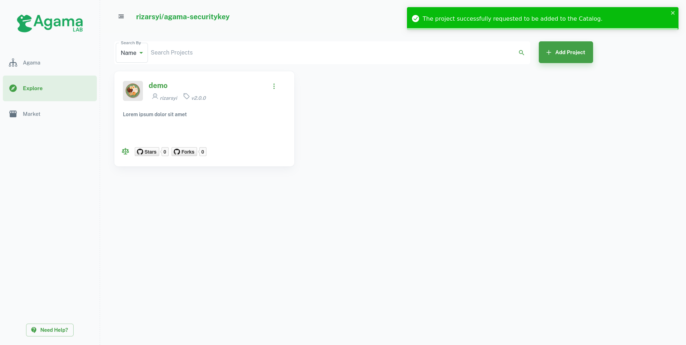
