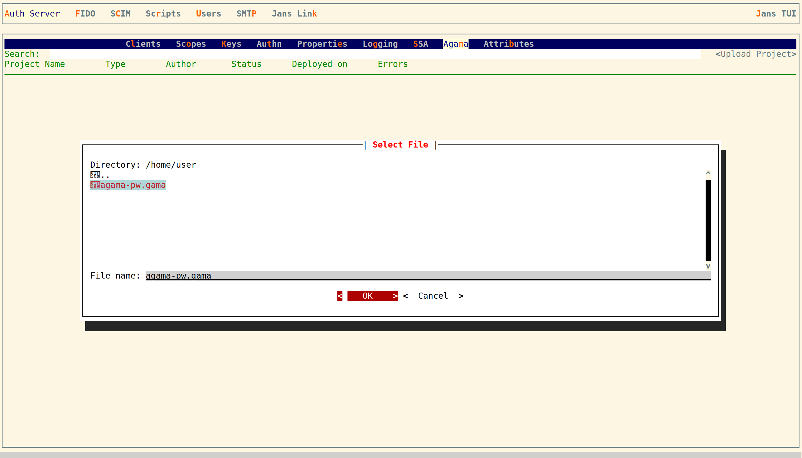
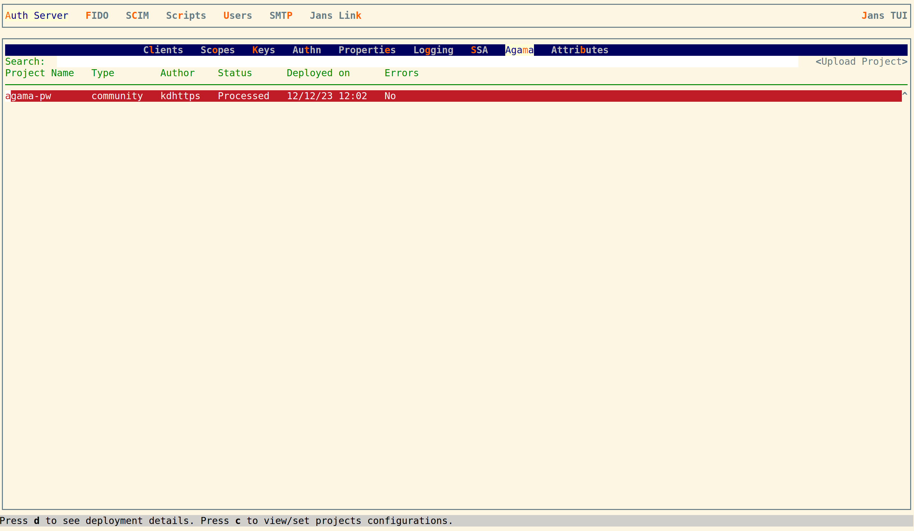

## Overview

Agama Lab tool helps developers to make a flow for Jans Agama.

Agama Docs : https://docs.jans.io/head/agama/introduction

## Table of Content

- [Overview](#overview)
- [Agama-Lab Online Tool](#agama-lab-online-tool)
- [Install GitHub-App and select Repository](#install-github-app-and-select-repository)
- [Make a Project](#make-a-project)
- [Make a Flow File](#make-a-flow-file)
- [Make a Simple Basic Auth Flow](#make-a-simple-basic-auth-flow)
- [Download Basic Flow](#download-basic-flow)
- [Make a template file](#make-a-template-file)
- [Make a gama file / Release Project](#make-a-gama-file---release-project)
- [Deploy a gama file on Jans](#deploy-a-gama-file-on-jans)
- [Testing using Jans Tent](#testing-using-jans-tent)

## Agama-Lab Online Tool

Use https://cloud.gluu.org/agama-lab online tool to make an agama flow.

Hit the above URL and you will see a page with the `Sign in with GitHub` button. Click on it and give access to agama-lab.


## Install GitHub-App and select Repository

In the next step, You need to install a GitHub App which will allow Agama-Lab to commit and push changes to your repository. Agama-Lab uses your repository to store the whole project's data and flow files.


While GitHub-App installation it will ask you to choose a repository. If you missed it, add a repository using GitHub settings `GitHub Settings > Integrations > Applications > agama-lab > Repository Access`.


Use the `Select Repository` button to choose a repository. Your repository must have at least one Git Commit to proceed. Just making a fresh new repo with README.md will be good. Click on the `Create Project` button to proceed next.


## Make a Project

The first step is to make a Project.


Navigate to the Project Tree File view to make Agama Flows and `.gama` files.


## Make a Flow File

- Right-click on the `Code` folder and select New Flow file. You can double-click on files to open it.
  

- Enter Details in Form and click on the `Create` button.
  

## Make a Simple Basic Auth Flow

### 1.


### 2.


### 3.


### 4.


### 5.


### 6.


### 7.


### 8.


### 9.

Make sure to check `In Repeat Block` checkbox.


### 10.


### 11.


### 12.


### 13.


### 14.


### 15.


### 16.


### 17.


### 18.


### 19.


### 20.


- Save it and you can click on the `Code` button to see the actual flow


- It will look like


```
Flow agama.pw
     Basepath ""
authService = Call io.jans.as.server.service.AuthenticationService#class
cdiUtil = Call io.jans.service.cdi.util.CdiUtil#bean authService
authResult = {}
Repeat 3 times max
     creds = RRF "login.ftlh" authResult
     authResult.success = Call cdiUtil authenticate creds.username creds.password
     authResult.uid = creds.username
     // check auth response
     When authResult.success is true
          it_lfnnw = { success: true, data: { userId: authResult.uid } }
          Finish it_lfnnw
it_dnyli = { success: false, error: "auth failed" }
Finish it_dnyli
```

## Download Basic Flow

If you created the above flow successfully then skip this part. There is an import facility. If you have any existing flow's JSON file then you can directly import and make a flow quickly.

[co.basic.zip](./assets/agama.pw.zip)

Download the above zip, extract it, and import the JSON file:


## Make a template file

The above flow uses using `login.ftlh` template file. Let's create it.

- Right-click on the `web` folder and select the new free maker template
  

- Select Template and add details. It is up to you to make a beautiful design using UI-Editor.
  

- Edit HTML to add existing code. You can make your own.
  

```html
<!DOCTYPE html>
<html xmlns="http://www.w3.org/1999/xhtml">
  <head>
    <title>Jans Agama Basic Auth flow</title>
  </head>
  <body>
    <h2>Welcome</h2>
    <hr />

    [#if !(success!true)]
    <p class="fs-6 text-danger mb-3">${msgs["login.errorMessage"]}</p>
    [/#if]

    <hr />
    <form method="post" enctype="application/x-www-form-urlencoded">
      <div>
        Username:
        <input
          type="text"
          class="form-control"
          name="username"
          id="username"
          value="${uid!}"
          required
        />
      </div>

      <div>
        Password:
        <input
          type="password"
          class="form-control"
          id="password"
          name="password"
        />
      </div>

      <div>
        <input type="submit" class="btn btn-success px-4" value="Login" />
      </div>
    </form>
  </body>
  <style>
    input {
      border: 1px solid #000000;
    }
  </style>
</html>
```

_Once you save the file. It will add `[#ftl output_format="HTML"]` which is needed because we are using `[#if...` instead of `<#if...`._

> Notice
> If you want to add code like `<input type="submit" class="btn btn-success px-4" value="${msgs["login.login"]}">` then it will not work instead of add `<input type="submit" class="btn btn-success px-4" value="${msgs['login.login']}"/>`.You need to use a single quote inside a double quote.

## Download a gama file

- Right-click on anything in File Tree and select `Download .gama`


## Deploy a gama file on Jans

- Make sure you have enabled Agama and Agama Script on your Jans server. [Check Agama Docs for Details](https://docs.jans.io/head/agama/introduction/)

- Let's enable it using TUI, Open TUI in your Jans Server

```
# cd /opt/jans/jans-cli
# python3 jans_cli_tui.py
```

- Enable Agama Configuration, In TUI, navigate to `AuthServer > Properties > agamaConfiguration > Enabled [*] > Save`
  

- Enable Agama Script, In TUI, navigate to `Scripts > Search 'agama' > Select script Enabled [*] > Save`
  

- Move your `.gama` file to your Jans server

- Navigate to `Auth Server > Agama > Upload Project`
  

- Select a file and upload
  

- You should see now uploaded project in the list. Check it after some minute or press `d` to check details.
  

_Check your Jans logs for Any Errors. Log file path is `/opt/jans/jetty/jans-auth/logs/jans-auth.log`_

## Testing using Jans Tarp

- Setup Jans-Tarp. [Instructions](https://github.com/JanssenProject/jans/tree/main/demos/jans-tarp)

- Configuration to run Agama flow

- Add Your Jans Auth server host and click on `Register` client. It will register new OP Client on your Auth server.
  

- Add additional params `{ "agama_flow": "agama.pw" }` and select acr value `agama` and click on `Trigger Auth Code flow`
  

- It will trigger agama flow and show login screen to you. You can use TUI to add testing user.
  

- After successful auth, it will show you below screen
  
