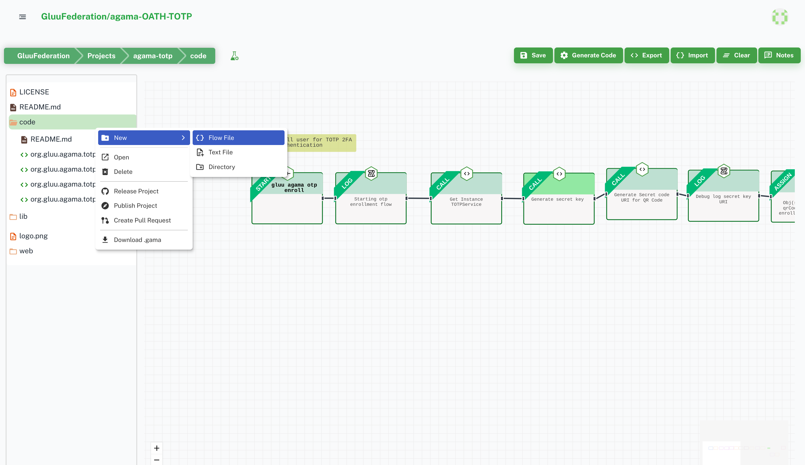
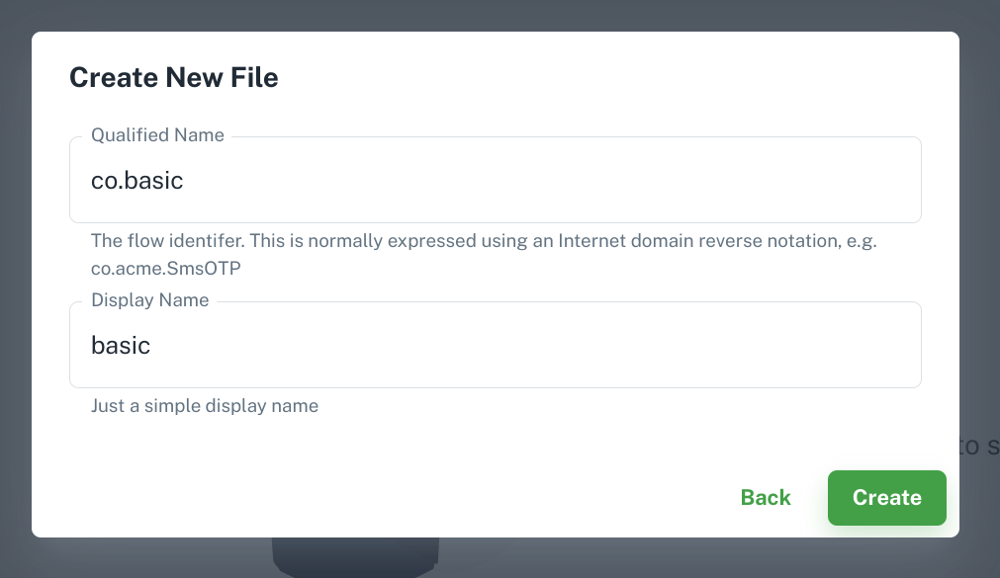
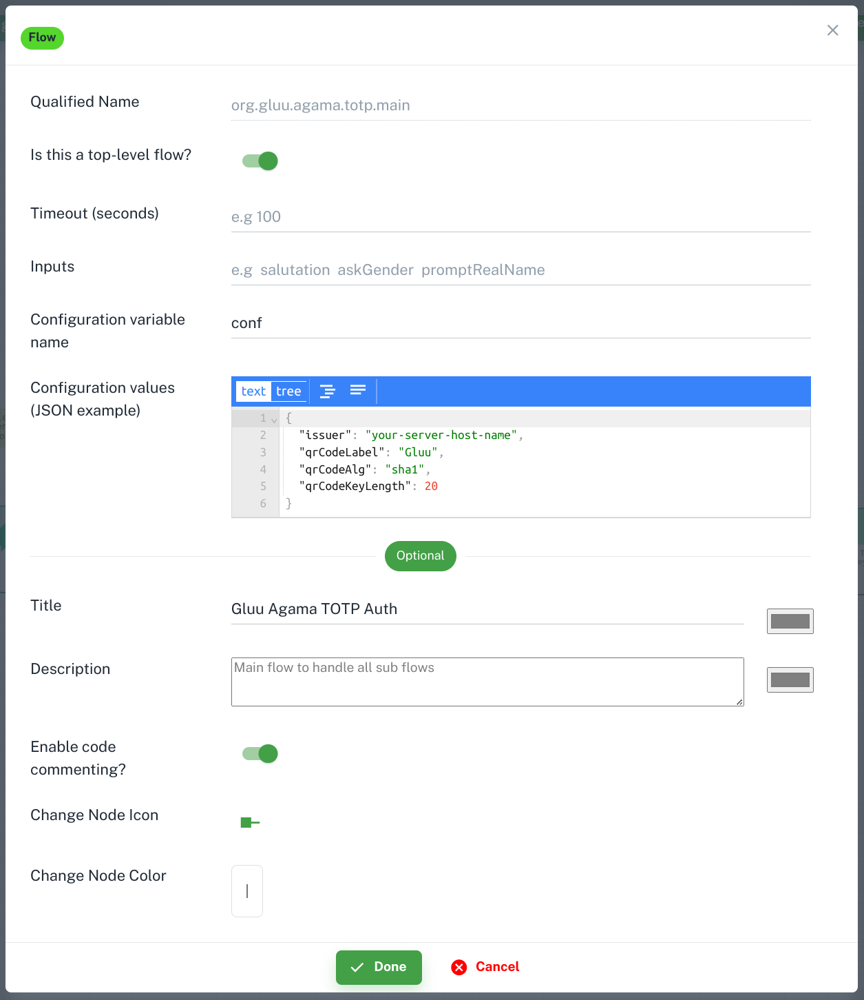

# Agama Flow

Agama is a framework that consists of:

- A DSL (domain-specific language) purposedly designed for writing web flows
- A set of rules that drive the behavior of such flows when they are executed
- The specification of a file format - known as .gama - useful for sharing Agama flows. Flows have the .flow file extension.

Here, a web flow is understood as a process composed by one or more stages, where at each stage an actor - normally a person - provides some kind of data or response by using a web browser or similar client. Throughout the process only a single actor is involved.

Check [Agama Doc](https://docs.jans.io/head/agama/introduction/) for more details.

## Create new flow

`code` folder is for Flows. Right click on `code` folder to add flow file.

The flow qualified name is normally expressed using an Internet domain reverse notation, e.g. `co.acme.SmsOTP`.
Check [here](https://docs.jans.io/head/agama/language-reference/#flow-structure) for details.

## Start Widget

The flow is begin from `Start` node. It contains several information about flow.

- `Qualified Name`: It is same name which you added during flow file creation. Curretly there is no feature to rename flow. You need to delete and create new one with new name. [More details](https://docs.jans.io/v1.1.0/agama/language-reference/#header-basics)

- `Is this a top-level flow?`: This feature help to prevent flows to be launched directly from a web browser. It's a security measure to avoid end-users triggering flows at will. If it is `true` then user can trigger it from browser otherwise not. Agama-lab uses it to populate `noDirectLaunch` property in `ads.json` and `project.json`. [More Details](https://docs.jans.io/v1.1.0/agama/language-reference/#header-basics)

- `Timeout (seconds)`: This is the maximum amount of time the end-user can take to fully complete a flow. [More Details](https://docs.jans.io/v1.1.0/agama/language-reference/#header-basics)

- `Inputs`: Flows may receive inputs from their callers. [More Details](https://docs.jans.io/v1.1.0/agama/language-reference/#inputs)

- `Configuration variable name`: It used to define config variable name. The `Configs` keyword may be used to designate a variable so the flow's properties can be accessed in the code. These properties are usually provided when the flow is created - normally through an administrative tool. This process varies from engine to engine.
