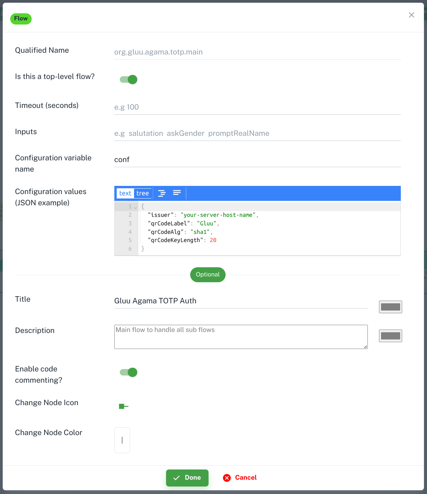
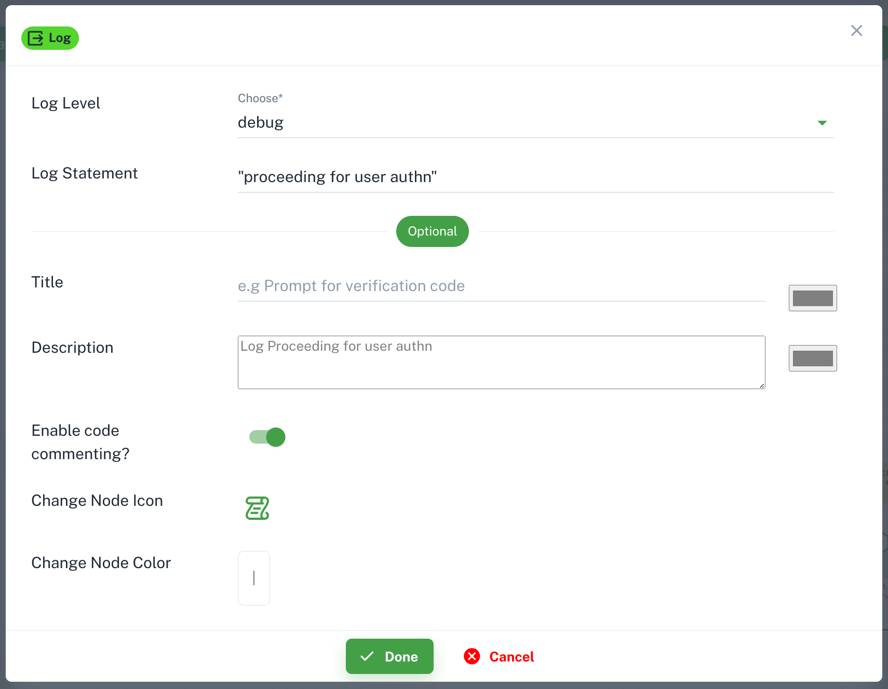
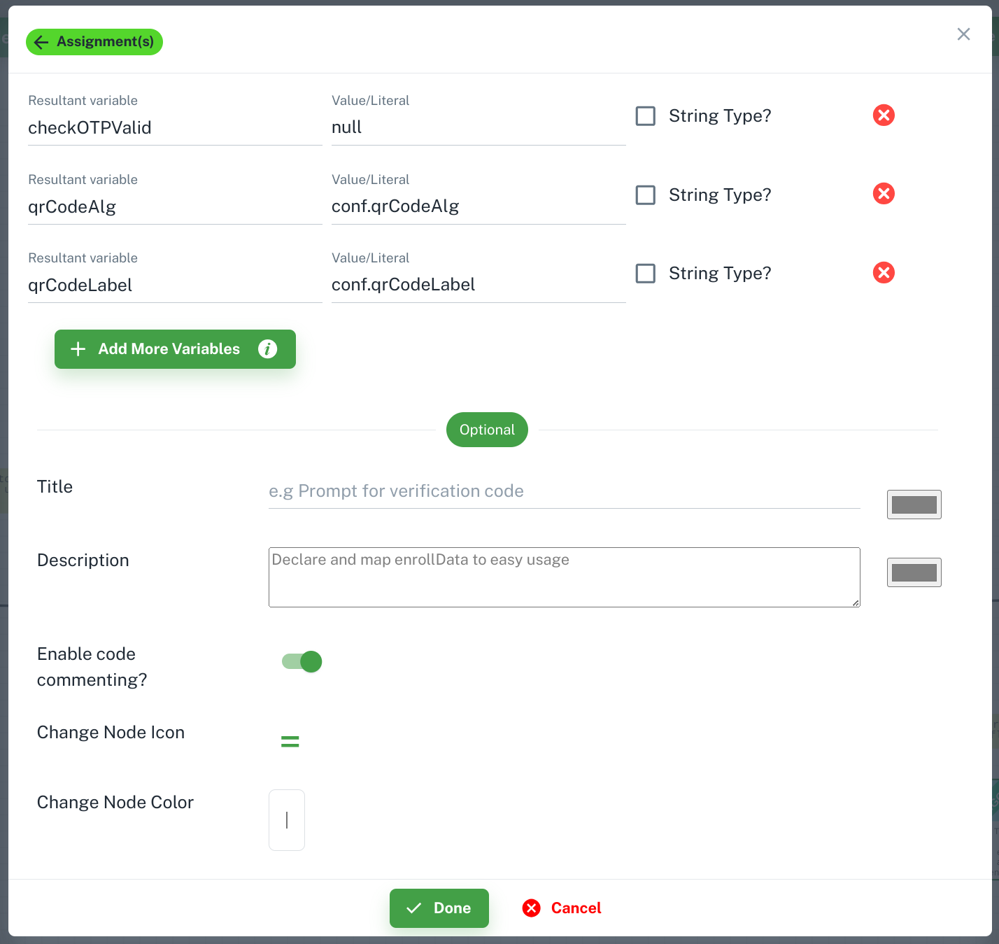
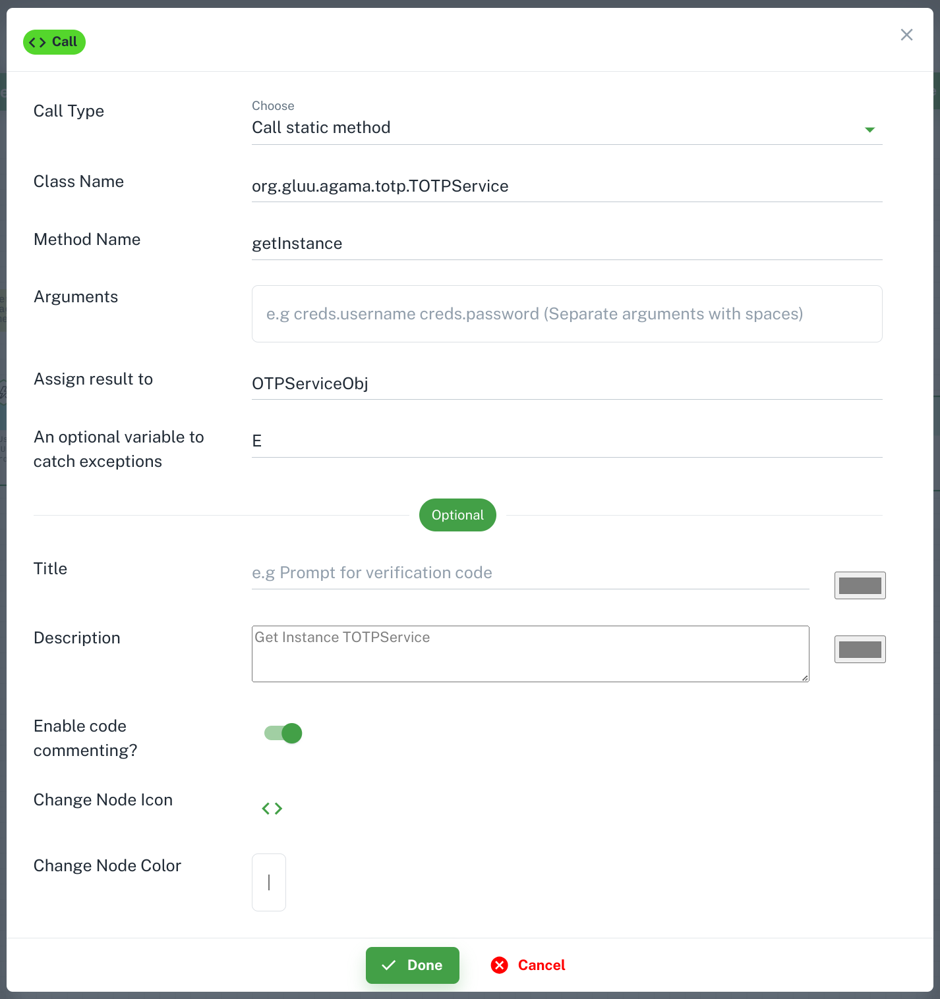
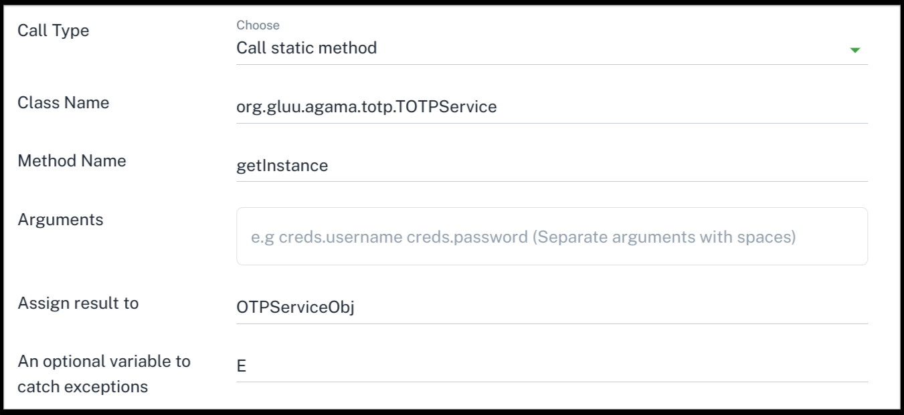
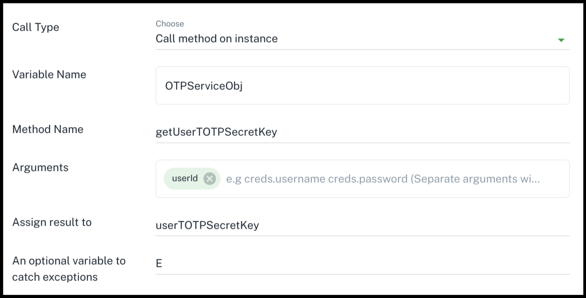
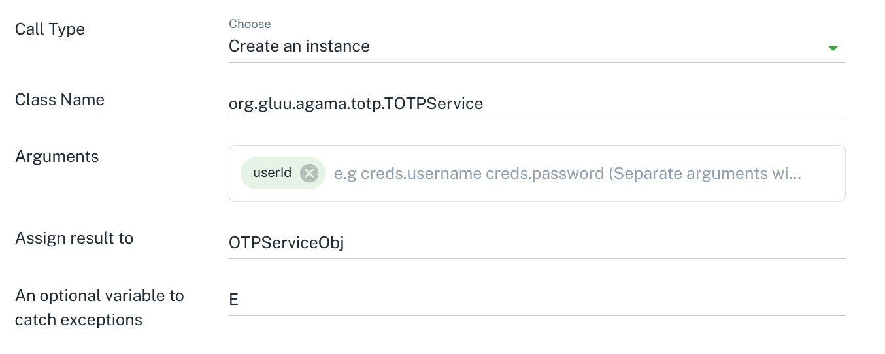
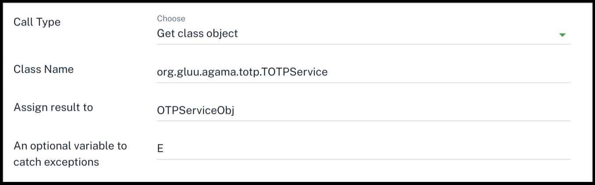

# Agama Flow

Agama is a framework that consists of:

- A DSL (domain-specific language) purposedly designed for writing web flows
- A set of rules that drive the behavior of such flows when they are executed
- The specification of a file format - known as .gama - useful for sharing Agama flows. Flows have the .flow file extension.

Here, a web flow is understood as a process composed by one or more stages, where at each stage an actor - normally a person - provides some kind of data or response by using a web browser or similar client. Throughout the process only a single actor is involved.

Check [Agama Doc](https://docs.jans.io/head/agama/introduction/) for more details.

## Create new flow

`code` folder is for Flows. Right click on `code` folder to add flow file.


The flow qualified name is normally expressed using an Internet domain reverse notation, e.g. `co.acme.SmsOTP`.
Check [here](https://docs.jans.io/head/agama/language-reference/#flow-structure) for details.


## Start Widget

The flow is begin from `Start` node. It contains several information about flow.



- `Qualified Name`: It is same name which you added during flow file creation. Curretly there is no feature to rename flow. You need to delete and create new one with new name. [More details](https://docs.jans.io/head/agama/language-reference/#header-basics)

- `Is this a top-level flow?`: This feature help to prevent flows to be launched directly from a web browser. It's a security measure to avoid end-users triggering flows at will. If it is `true` then user can trigger it from browser otherwise not. Agama-lab uses it to populate `noDirectLaunch` property in `ads.json` and `project.json`. [More Details](https://docs.jans.io/head/agama/language-reference/#header-basics)

- `Timeout (seconds)`: This is the maximum amount of time the end-user can take to fully complete a flow. [More Details](https://docs.jans.io/head/agama/language-reference/#header-basics)

- `Inputs`: Flows may receive inputs from their callers. [More Details](https://docs.jans.io/head/agama/language-reference/#inputs)

- `Configuration variable name`: It used to define config variable name. The `Configs` keyword may be used to designate a variable so the flow's properties can be accessed in the code. You can use below `Configuration values` to add properties and values for flow. [More Details](https://docs.jans.io/head/agama/language-reference/#header-basics)

- `Configuration values`: Add properties and its value for flow. Which you can use in flow. Like `client id`, `client secret`, etc.

- There are some common tools which you can find in every widget. `Title`, `Description`, `Enable code commenting`, `Change node icon`, and `Change node color` these tools are useful for widget design.

## Log Widget

Flows can issue small messages (normally used as a form of troubleshooting) that will be appended to a log `jans-auth.log`. On Jans server you can find log file at `/opt/jans/jetty/jans-auth/logs/jans-auth.log` location.



- `Log level`: Every message can be associated a severity level. Choose it as per your need.

- `Log statment`: Your log message. You can add variable also check [here](https://docs.jans.io/head/agama/language-reference/#logging) for more details.

## Assignment Widget

Used to declare and intialize variable. Click on `+ Add More Variables` to add variable. Check `String Type?` if value is string. You can add multiple variable.



## Call Widget

Call widget helps to build `Call` instruction in flow code. Business logic implemented in languages other than Agama can be re-used by means of the `Call` instruction. `Call` plays a key role because Agama code serves fundamentally as a depiction of a flow hiding most of the internal details and low-level computations which are in turn delegated to foreign routines. [More Details](https://docs.jans.io/head/agama/language-reference/#foreign-routines).



There are 4 options to build a `Call` instruction.

### Call static method

If you want to call a static method of class then you can use this option.



This will generate the flow code like:

```
OTPServiceObj | E = Call org.gluu.agama.totp.TOTPService#getInstance
```

`E` store the exception. You can log it to find errors in your code.

### Call method on instance

If you want to call a method of instance or object thne use this option.



This will generate the flow code like:

```
userTOTPSecretKey | E = Call OTPServiceObj getUserTOTPSecretKey userId
```

### Create a instance

If you want to create a instance of a class then use this option.



This will generate the flow code like:

```
OTPServiceObj | E = Call org.gluu.agama.totp.TOTPService#new userId
```

### Get class object

If you want to get a class object thne use this option.



This will generate the flow code like:

```
OTPServiceObj | E = Call org.gluu.agama.totp.TOTPService#class
```
