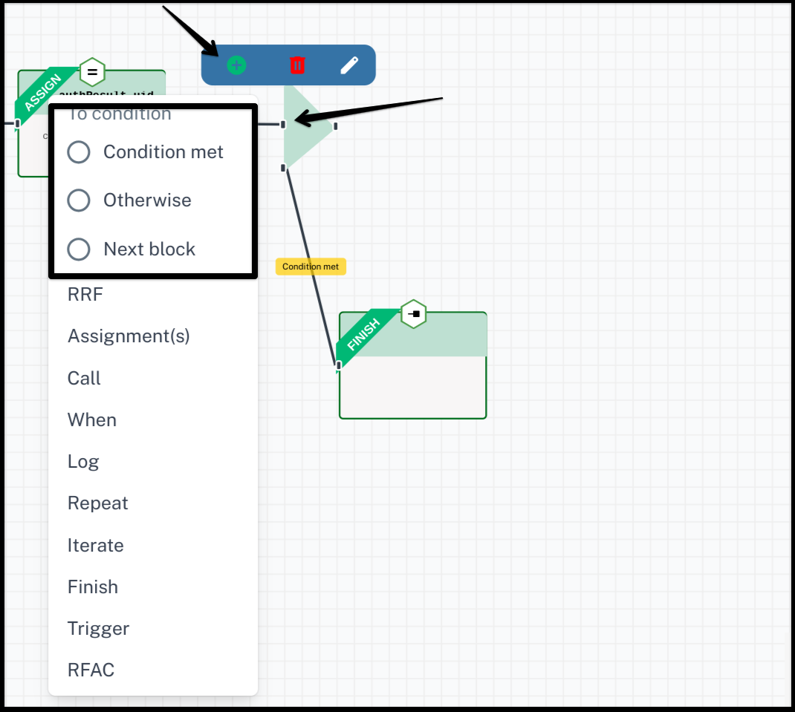

# Agama Flow

Agama is a framework that consists of:

- A DSL (domain-specific language) purposedly designed for writing web flows
- A set of rules that drive the behavior of such flows when they are executed
- The specification of a file format - known as .gama - useful for sharing Agama flows. Flows have the .flow file extension.

Here, a web flow is understood as a process composed by one or more stages, where at each stage an actor - normally a person - provides some kind of data or response by using a web browser or similar client. Throughout the process only a single actor is involved.

Check [Agama Doc](https://docs.jans.io/head/agama/introduction/) for more details.

## Create new flow

`code` folder is for Flows. Right click on `code` folder to add flow file.


The flow qualified name is normally expressed using an Internet domain reverse notation, e.g. `co.acme.SmsOTP`.
Check [here](https://docs.jans.io/head/agama/language-reference/#flow-structure) for details.


## Start Widget

The flow is begin from `Start` node. It contains several information about flow.


- `Qualified Name`: It is same name which you added during flow file creation. Curretly there is no feature to rename flow. You need to delete and create new one with new name. [More details](https://docs.jans.io/head/agama/language-reference/#header-basics)

- `Is this a top-level flow?`: This feature help to prevent flows to be launched directly from a web browser. It's a security measure to avoid end-users triggering flows at will. If it is `true` then user can trigger it from browser otherwise not. Agama-lab uses it to populate `noDirectLaunch` property in `ads.json` and `project.json`. [More Details](https://docs.jans.io/head/agama/language-reference/#header-basics)

- `Timeout (seconds)`: This is the maximum amount of time the end-user can take to fully complete a flow. [More Details](https://docs.jans.io/head/agama/language-reference/#header-basics)

- `Inputs`: Flows may receive inputs from their callers. [More Details](https://docs.jans.io/head/agama/language-reference/#inputs)

- `Configuration variable name`: It used to define config variable name. The `Configs` keyword may be used to designate a variable so the flow's properties can be accessed in the code. You can use below `Configuration values` to add properties and values for flow. [More Details](https://docs.jans.io/head/agama/language-reference/#header-basics)

- `Configuration values`: Add properties and its value for flow. Which you can use in flow. Like `client id`, `client secret`, etc.

- There are some common tools which you can find in every widget. `Title`, `Description`, `Enable code commenting`, `Change node icon`, and `Change node color` these tools are useful for widget design.

## Log Widget

Flows can issue small messages (normally used as a form of troubleshooting) that will be appended to a log `jans-auth.log`. On Jans server you can find log file at `/opt/jans/jetty/jans-auth/logs/jans-auth.log` location.


- `Log level`: Every message can be associated a severity level. Choose it as per your need.

- `Log statment`: Your log message. You can add variable also check [here](https://docs.jans.io/head/agama/language-reference/#logging) for more details.

## Assignment Widget

Used to declare and intialize variable. Click on `+ Add More Variables` to add variable. Check `String Type?` if value is string. You can add multiple variable.


## Call Widget

Call widget helps to build `Call` instruction in flow code. Business logic implemented in languages other than Agama can be re-used by means of the `Call` instruction. `Call` plays a key role because Agama code serves fundamentally as a depiction of a flow hiding most of the internal details and low-level computations which are in turn delegated to foreign routines. [More Details](https://docs.jans.io/head/agama/language-reference/#foreign-routines).


There are 4 options to build a `Call` instruction.

### Call static method

If you want to call a static method of class then you can use this option.


This will generate the flow code like:

```
OTPServiceObj | E = Call org.gluu.agama.totp.TOTPService#getInstance
```

`E` store the exception. You can log it to find errors in your code.

### Call method on instance

If you want to call a method of instance or object thne use this option.


This will generate the flow code like:

```
userTOTPSecretKey | E = Call OTPServiceObj getUserTOTPSecretKey userId
```

### Create a instance

If you want to create a instance of a class then use this option.


This will generate the flow code like:

```
OTPServiceObj | E = Call org.gluu.agama.totp.TOTPService#new userId
```

### Get class object

If you want to get a class object thne use this option.


This will generate the flow code like:

```
OTPServiceObj | E = Call org.gluu.agama.totp.TOTPService#class
```

## RRF Widget

RRF (stands for Render-Reply-Fetch) abstracts the process of rendering a UI template, send the produced markup to the browser and grab user-provided data back at the server side. RRF widget help to add RRF instruction in flow code. [More details](https://docs.jans.io/head/agama/language-reference/#rrf)


As per above example, It will generate flow code like:

```
scanCode = RRF "enroll.ftlh" obj
```

- `Template path`: Used to specify the your web template file path.
  Examples:

  - If your file is in `web/login.ftlh` then its value should be `login.ftlh`
  - If your file is in `web/first/login.ftlh` thne its value should be `first/login.ftlh`

- `Data variable to inject`: It used to define the variable which used to pass data to template.

- `Assign result to`: It used to define variable which used to stored data send by user - a map whose keys are named according to the form fields present in `.ftlh` page.

## RFAC Widget

RFAC widget help to add RFAC instruction in flow. RFAC (stands for Redirect and Fetch at callback) abstracts the process of redirecting the user's browser to an external site and then collect the data presented later at a designated callback URL. This feature is particularly useful in inbound identity scenarios (e.g. to support social login).


- `IDP Auth Endpoint`: Its your IDP endpoint where you want to redirect user.

- `Assign callback result to`: Once the user browser is taken to the callback URL by the external site, the data included in the query string or payload is stored in result (a map) for further processing.

## Trigger Widget

Trigger Widget help to add `Trigger` instruction in flow. A flow can trigger another flow (a.k.a `subflow`) and grab its response when Finished. This feature materializes flow composition and re-use in Agama. [More details](https://docs.jans.io/head/agama/language-reference/#subflows).


- `Flow name`: Used to define which subflow you want to trigger.

- `Arguments`: Used to pass values to subflow. Which you can later used in subflow by using `Inputs` by defining in header.

- `Assign Result to`: Store subflow response in variable.

## Repeat Widget

Repeat was designed with the concept of attempts/retries in mind: a set of statements are executed, a condition can optionally be supplied in order to abort the loop early, and (optionally too) a block of statements can be executed before the next iteration is started if the condition evaluated to false. A loop is given a maximum number of iterations. [More Details](https://docs.jans.io/head/agama/language-reference/#looping).


Use `In Repeat Block` to add instructions inside Repeat Block otherwise it will add instructions out side of repeat block.


## When Widget

It helps to add condition in flow. Use `+ Rule` button to add condition and `Combinator` to add conditional operator in multiple condition case.


Click on `When` widget, Click on `+` icon and you will get 3 options.



- `Condition met`: Instructions in this block will execute when your condition will be true.

- `Otherwise`: Instructions in this block will execute when your condition will be false.

- `Next block`: Use this option to add instructions outside of `When` block.

## Iterate Widget

`Iterate` over is used to traverse the items of a string, list, or the keys of a map. At every iteration, a variable is set with the current item or key name. [More details](https://docs.jans.io/head/agama/language-reference/#iterate-over).


## Finish

Finish is used to terminate a flow's execution. A flow can finish successfully or failed.

### Success Finish

You can choose first option `Flow finished successfully` in flow success case.


In `Start` widget if you have set flow as a top level then you need to pass `userId` in finish widget in success case. Like in below example:


### Fail Finish

Second option `Flow finished with error` is for failed case. You can pass variable or value or string in response.


### Flow finished with a variable

This is third option. You can used it in both success and fail case. You just need to pass your variable name.


