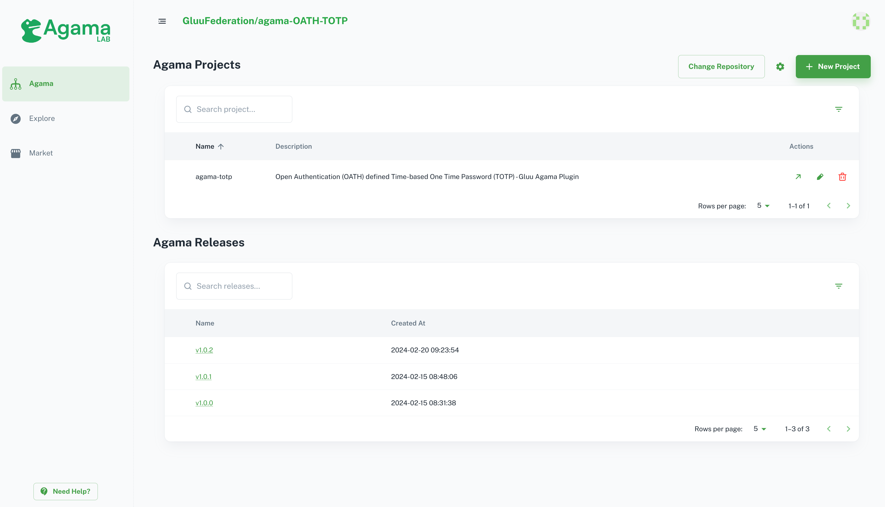

# Agama Lab

The SAAS Platform https://cloud.gluu.org/agama-lab

# Introduction

Agama Lab makes it easy to use low code block programming to build custom web login flows for your business. The Agama Programming Language, developed at the Linux Foundation Janssen Project, is a vendor neutral, domain specific language for `identity orchestration`. Agama also defines a standard project archive format–`.gama`, enabling you to deploy your project as a single file. Agama Lab, hosted by Gluu, is a developer website where you can find, author, and publish Agama projects. All of this powered by [Gluu](https://gluu.org).

This platform lets you create customize agama projects, agama flows, web pages, publish flows to community, find, and use community available security agama flows. Agama-Lab uses your GitHub repository to store your project files.

Agama-Lab helps to simplify the agama flow development by:

- Offering the control panel to build and manage flows using orchestration tool.
- Easy to add more complex business logic easily by adding `.java` and `.groove` files.
- Provide UI Editor to add custom web pages. Its fully customizable.
- Easy version control using GitHub. Agama-Lab uses your GitHub repository to store your projects files.
- Releases project versions.
- Easy to build `.gama` file.
- Build project and test on testing environment.
- Publish projects to community and will be available and easy to access in explore section.
- Easy to shop Gluu products.

## What is Agama?

Agama is a framework that consists of:

- A DSL (domain-specific language) purposedly designed for writing web flows
- A set of rules that drive the behavior of such flows when they are executed
- The specification of a file format - known as `.gama` - useful for sharing Agama flows. Flows have the `.flow` file extension.

Here, a web flow is understood as a process composed by one or more stages, where at each stage an actor - normally a person - provides some kind of data or response by using a web browser or similar client. Throughout the process only a single actor is involved.

[More Details](https://docs.jans.io/head/agama/introduction)

## Quick Start

Start your agama lab journey with our Quick Start Guide [here]().

### 1. Agama Projects

This section provides you a set of tools to create and manage agama projects and flows. [More Details]().

### 2. Explore Projects

Connect with agama community and explore freely available agama projects and flows.

### 3. Gluu Market

Buy and view Gluu products.

