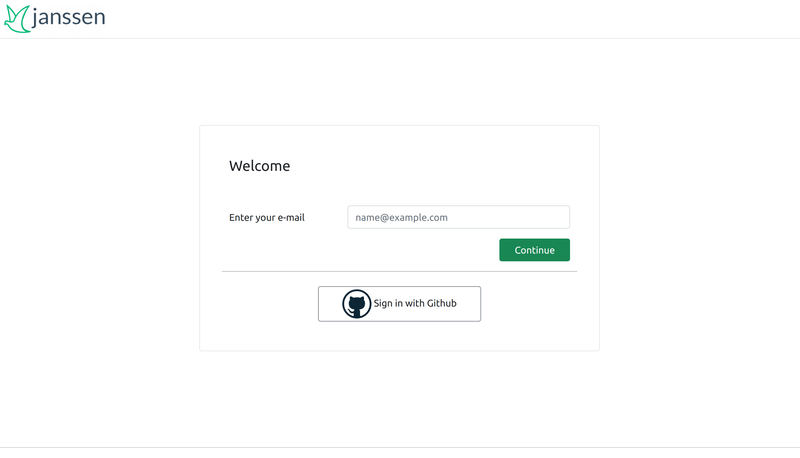
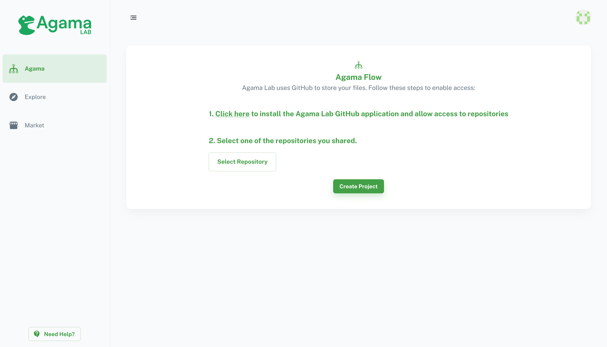

# Log into Agama LAb

Use https://cloud.gluu.org/agama-lab online tool to make an agama flow.

Hit the above URL and you will see a page with the `Sign in with GitHub` button. Click on it and give access to agama-lab. Agama-Lab uses your repository to store projects and flows. This approach is also help to manage project versions, easy and secure storage, and easy to share projects with community.

## Install GitHub-App and select Repository

In the next step, You need to install a GitHub App which will allow Agama-Lab to commit and push changes to your repository. Agama-Lab uses your repository to store the whole project's data and flow files.

While GitHub-App installation it will ask you to choose a repository. If you missed it, add a repository using GitHub settings `GitHub Settings > Integrations > Applications > agama-lab > Repository Access`.

Use the `Select Repository` button to choose a repository. Your repository must have at least **one Git Commit** to proceed. Just making a fresh new repo with README.md will be good. Click on the `Create Project` button to proceed next.

