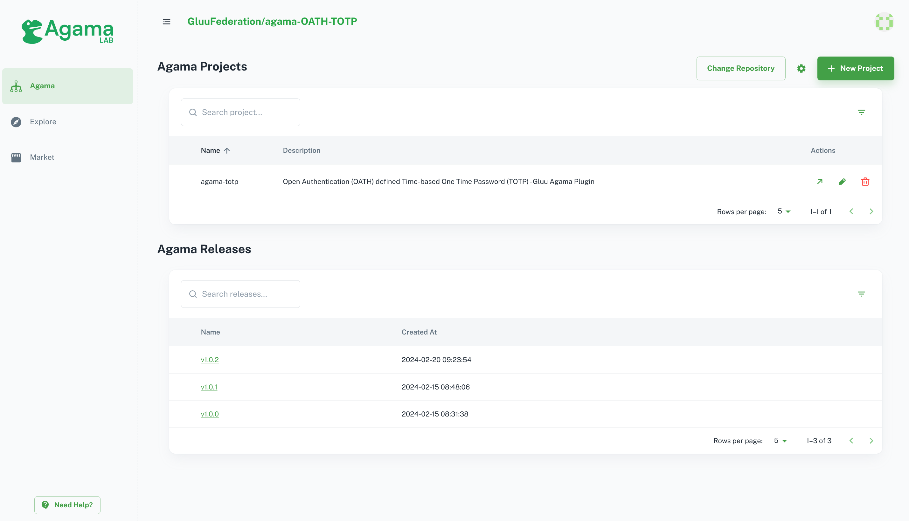

# Manage Projects

This section provides you a set of tools to create and manage agama projects. You can add one or multiple projects in one Reposotory.

> Note: In above screenshot, it is published repository. You cannot add multiple projects in published repository but it help you to add your project to Agama-Explore. You need it only when you want to add project in Agama-Explore. Check [here]() for details.

## Tools

1. Change Repository
   At the top of project list you can see `Change Repository` button which you can choose to change your repository and it will show you selected repository on top.

   

2. Install GitHub-App
   Use `Gear Icon` to add GitHub app and add your repository where you want to add/manage projects. This features helps when you miss to add repository in GitHub app in intial stages.

3. Add new Project
   Use `+ New Project` button to add new project

4. Project Actions

   

   1. Use Navigate button to open project manage page where you can manage flow files, java code files, and web template pages.
   2. Use Edit button to edit project description
   3. Use Delete button to delete project

## Agama Releases

In this section, you can see the list of releases of your project. You can click on version number and it will nativate you to your GitHub release page. If you want to release new version, check the `Release` option in manage project [here]().
