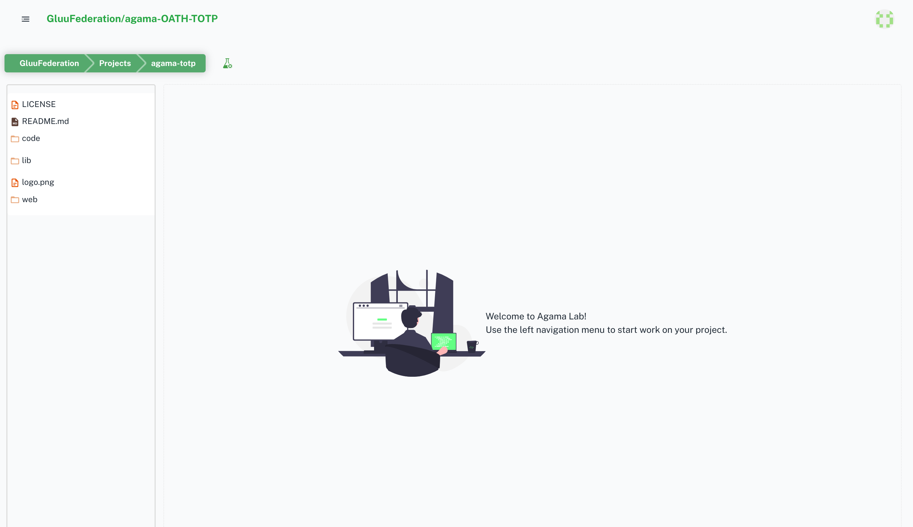
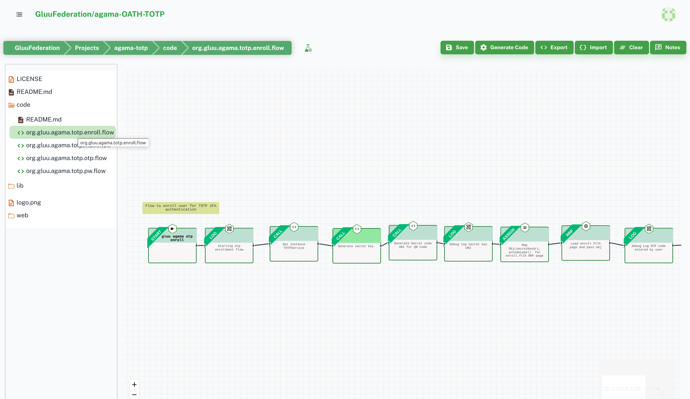
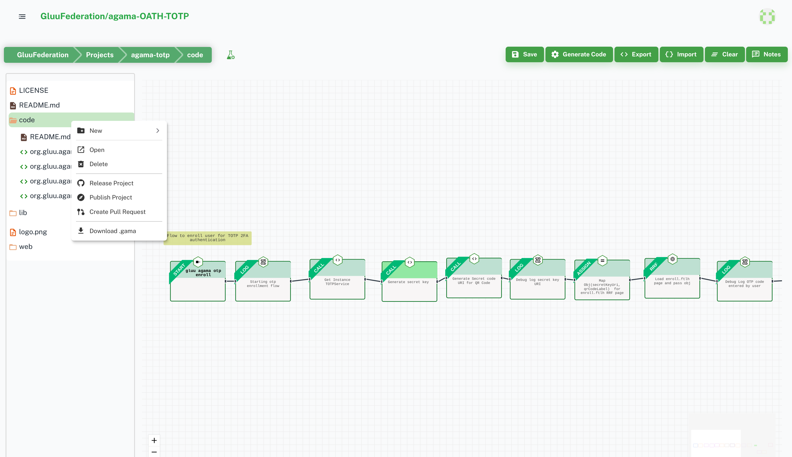
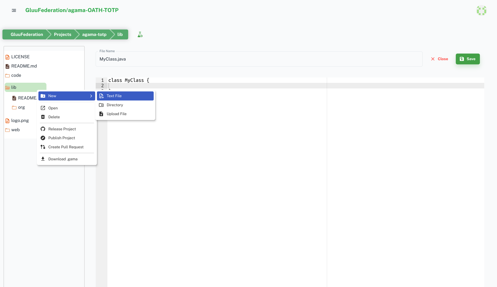
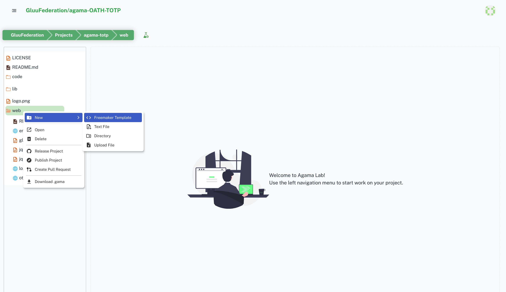

# Project Orchestration

This section provides you a set of tools to manage projects' flows, web template pages, java code file, and other project assets.

Below are some tools and tips to use project orchetration:

- Double click on file to open file
  

- Select Folder and right click to open context menu for more operations and features.
  

- `code` folder is for Flows. Right click on `code` folder to add flow file
  

- `lib` folder is for java and groovy libraries. You can add `.jar`, `.java`, and `.groovy` file in lib folder and use in flow.
  

- `web` folder is for web pages and templates. You can add images, templated pages(.ftlh), js, and css files.
  

- `logo.png`: you can add `logo.png` file to your repository root. If your project is in explore section then agama-lab will automatically fetches this logo.png and show it in projects grid.

- Deploy and testing flow
  On the top, beside breadcrumbs there is test icon. You can deploy your project on our testing server and quickly test and find bugs problems. Check [here]() for details.
