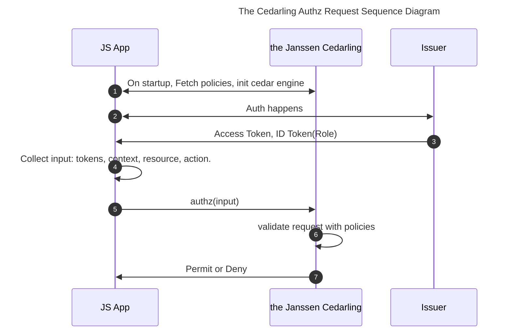

# React RBAC authorization with the Cedarling integration


This guide demonstrates how to implement **Role-Based Access Control (RBAC)** policy-based authorization in React applications using [the Janssen Project Cedarling](https://docs.jans.io/v1.5.0/cedarling/cedarling-overview/).

We'll walk through setting up the integration with a practical example involving multiple roles and conditional policies. You'll learn how to:

- Define the authorization schema
- Configure access policies
- Evaluate authorization requests
- Implement Cedarling's streamlined authorization in React with minimal code

# Use Case: Multi Role Access control in a Project Task Management System

- Principals: Users with roles like `Admin`, `Manager` and `Member`.
- Actions: `Add`, `Update`, `Delete`, and `View`
- Resources: Task

Roles and Permissions:

1. Admin:

   - Can perform any operation

1. Manager:

   - Can perform `Add`, `Update`, `View`
   - Cannot perform `Delete`

1. Member

   - Can perform only `View`

# Prerequisite

1. **OpenID Connect Server**: Use any compliant provider like [Janssen](https://docs.jans.io), Google, Okta.

1. **React Application**: Use any framework like `Next.js` or `Vite.js` to create a Fresh React App.

# Authorization Flow

The sequence diagram below illustrates Cedarling's authorization process. The `Janssen Cedarling` library handles policy evaluation within your JavaScript React application.



# Setting Up Policies

We'll use the [Agama-Lab](https://cloud.gluu.org/agama-lab) Policy Designer to create and manage our authorization policies. [More Details](https://gluu.org/agama/authorization-policy-designer/).

## Step 1: Create Policy Store

1. Signin into [Agama Lab UI Tool](https://cloud.gluu.org/agama-lab) using GitHub.

1. Open `Policy Designer` section.

1. Select repository where you want to save your policies. [More Details](https://gluu.org/agama/authorization-policy-designer/)

1. Create a new policy store named `JanssenReactCedarlingRBAC`.

## Step 2: Define Schema

1. Open `Manage Policy Store` section by clicking arrow link button on store list.

1. Add `Task` in Entity Type.
   

1. Configure actions (`Add`, `Update`, `Delete`, `View`):

   - Set `Principal: User`
   - Set `Resources: Task`.

   

## Step 3: Create Policies

1. Go to `Manage Policy Store > Policies > Add Policy > Text Editor`.

1. Copy policies one by one, add in text editor, and save.

   1. **Admin Policy** (full access):

      ```js
      @id("AdminPerformAnyOperationOnResource")
      permit(
        principal in Jans::Role::"admin",
        action,
        resource
      );
      ```

   2. **Manager Policy** (restricted access):

      ```js
      @id("ManagerCanAddUpdateViewTask")
      permit (
        principal in Jans::Role::"manager",
        action in [Jans::Action::"Add",
        Jans::Action::"Update",
        Jans::Action::"View"],
        resource is Jans::Task
      );
      ```

   3. **Member Policy** (view only):

      ```js
      @id("MemberCanOnlyViewTask")
      permit (
        principal in Jans::Role::"member",
        action in [Jans::Action::"View"],
        resource is Jans::Task
      );
      ```

# Setting up React Application

## Step 1: Install Cedarling WASM

```sh
npm install @janssenproject/cedarling_wasm
```

For **Vite.js**, update `vite.config.ts`:

```js
import { defineConfig } from "vite";

export default defineConfig({
  optimizeDeps: {
    exclude: ["@janssenproject/cedarling_wasm"],
  },
});
```

## Step 2: Configure Cedarling

Initialize with these properties:

```js
export const cedarlingBootstrapProperties = {
  CEDARLING_APPLICATION_NAME: "AgamaLab",
  CEDARLING_POLICY_STORE_URI: "<your_policy_store_URI>",
  CEDARLING_POLICY_STORE_ID: "<your_policy_store_id>",
  CEDARLING_USER_AUTHZ: "enabled",
  CEDARLING_WORKLOAD_AUTHZ: "disabled",
  CEDARLING_LOG_TYPE: "std_out",
  CEDARLING_LOG_LEVEL: "TRACE",
  CEDARLING_LOG_TTL: 120,
  CEDARLING_PRINCIPAL_BOOLEAN_OPERATION: {
    "===": [{ var: "Jans::User" }, "ALLOW"],
  },
};
```

- `CEDARLING_POLICY_STORE_URI`: URL of your policy store (from Agama-Lab). In policy store list, use link button to copy policy store URI.

## Step 3: Create Authorization Client

This class implements a singleton pattern for managing Cedar authorization using WebAssembly (WASM), providing a centralized way to initialize the Cedar policy engine and perform authorization checks. It wraps the `@janssenproject/cedarling_wasm` module to handle policy evaluation through a single, reusable instance that can be accessed throughout the application.

```ts
class CedarlingClient {
  private static instance: CedarlingClient;
  private cedarling: Cedarling | null = null;
  private initialized = false;
  private wasmModule: any = null;

  private constructor() {}

  static getInstance(): CedarlingClient {
    if (!CedarlingClient.instance) {
      CedarlingClient.instance = new CedarlingClient();
    }
    return CedarlingClient.instance;
  }

  async initialize(policyStoreConfig: any): Promise<void> {
    if (!this.initialized) {
      this.wasmModule = await initWasm();
      console.log("WASM initialized", this.wasmModule);
      this.cedarling = (await init(policyStoreConfig)) as unknown as Cedarling;
      this.initialized = true;
    }
  }

  async authorize(request: any): Promise<AuthorizeResult> {
    if (!this.cedarling || !this.initialized) {
      throw new Error("Cedarling not initialized");
    }
    try {
      const result = await this.cedarling.authorize(request);
      return result;
    } catch (error) {
      console.error("Error during authorization:", error);
      throw error;
    }
  }
}

export const cedarlingClient = CedarlingClient.getInstance();
```

## Step 4: Initialize Cedarling

We are globally initializing cedarling object. You can add it in your app started files. Like in ViteJS case, you can add it in `App.tsx` and In Next JS case, you can add it in `src/layout.tsx`.

```js
useEffect(() => {
  cedarlingClient.initialize(cedarlingBootstrapProperties).catch(console.error);
}, []);
```

## Step 5: React Hook for Authorization

This Reack hook provides authorization functionality using the Cedarling client, with the ability to enforce authorization checks when enabled through environment variables. The hook manages loading and error states while processing authorization requests, and returns a boolean or AuthorizeResult indicating whether the authorization was successful.

```js
import { useCallback, useState } from "react";
import { cedarlingClient } from "./cedarlingUtils";
import { parseJwt } from "./parseJWT";
import { AuthorizeResult } from "@janssenproject/cedarling_wasm";

export function useCedarling() {
  const [isLoading, setIsLoading] = useState(false);
  const [error, setError] = useState<Error | null>(null);
  const authorize = useCallback(
    async (request: any): Promise<AuthorizeResult> => {
      setIsLoading(true);
      setError(null);
      try {
        // debug logs
        console.log("Enforcing Cedarling authorization");
        console.log("Request: ", request);
        console.log("Decoded idToken: ", parseJwt(request.tokens.id_token as string));
        console.log("Decoded accessToken: ",parseJwt(request.tokens.access_token as string));
        // userinfo token case
        // console.log('Decoded userInfo: ', parseJwt(request.tokens.userinfo_token as string))
        return await cedarlingClient.authorize(request);
      } catch (err) {
        const error = err instanceof Error ? err : new Error("Authorization failed");
        setError(error);
        throw error;
      } finally {
        setIsLoading(false);
      }
    },
    []
  );
  return { authorize, isLoading, error };
}
```

## Step 6: Protect Actions and Components

Use React Hook to protect actions and components. Your ID Token should have `role` claim. it can be one value like `role: admin` or array like `role: ["admin", "manager"]`, both are valid. Check [Cedarling entities document](https://docs.jans.io/v1.5.0/cedarling/cedarling-entities/) for more details about role entity creation and usage.

Below is example of Task React Page:

```js
import { useCedarling } from "@/factories/useCedarling";
import { AuthorizeResult } from "@janssenproject/cedarling_wasm";

export default function TasksPage() {
  const { authorize } = useCedarling();

  const cedarlingRequest = async (action: string) => {
    const idToken = "<your_id_token>";
    const accessToken = "<your_access_token>";

    const request = {
      tokens: {
        access_token: accessToken,
        id_token: idToken,
      },
      action: `Jans::Action::"${action}"`,
      resource: {
        type: "Jans::Task",
        id: "App",
        app_id: "App",
        name: "App",
        url: {
          host: "jans.test",
          path: "/",
          protocol: "http",
        },
      },
      context: {},
    };

    const result: AuthorizeResult = await authorize(request);
    return result;
  };

  const handleAdd = async () => {
    try {
      const result = await cedarlingRequest("Add");
      console.log(result);
      if (result.decision) {
        alert("Successfully added!");
      } else {
        alert("You are not allowed to add new Task!");
      }
    } catch (e) {
      alert("You are not allowed to add new Task!");
      console.log(e);
    }
  };
}

<button className="btn btn-primary mb-3" onClick={handleAdd}>
  <FaPlus className="me-2" />
  Add Task
</button>;
```

In above example there are 2 things:

- First, we make a function `cedarlingRequest` which accept action and help us to make an authorization requrest to the Cedarling WASM with Access Token and ID Token. Your ID Token should have Role claim and if you don't have role then you need to change policy which will be act like ABAC.

- Second, we have `handleAdd` function where it help us to request and check auth for `Add` operation. In response, it return result where we get which policy is responsible for authorization, timestamp, and dicision. Below is the example of result. Use `result.decision` to authorize request and show/hide elements.

```json
{
  "id": "0196118a-ce6e-74c8-9c25-5da154aa8b90",
  "request_id": "0196118a-ce6a-7653-b64c-e5fb9722c1d1",
  "timestamp": "2025-04-08T00:07:11.662Z",
  "log_kind": "Decision",
  "policystore_id": "87d2c8877a2455a16149c55d956565e1d18ac81ba10a",
  "policystore_version": "undefined",
  "principal": ["User"],
  "User": {},
  "diagnostics": {
    "reason": [
      {
        "id": "6b51f8244fe1fc3b273733f9d93def7f07080367fbc1",
        "description": "ManagerCanAddUpdateViewTask"
      }
    ],
    "errors": []
  },
  "action": "Jans::Action::\"Add\"",
  "resource": "Jans::Task::\"App\"",
  "decision": "ALLOW",
  "tokens": {
    "id_token": {
      "jti": "J4TB2NsgTZOBtPTYTzHtmg"
    },
    "access_token": {
      "jti": "hNhnQW18RA2AIOh5ihOfTQ"
    }
  },
  "decision_time_micro_sec": 3000,
  "pdp_id": "bbcf165b-1b7b-452a-af46-b9dbf3ae7cf0",
  "application_id": "AgamaLab"
}
```

Like we handled `Add` action, you can handle other actions and show hide components.

## Step 7: Protecting UI Components

This `ProtectedSection` component is a React wrapper that controls access to UI components based on user authorization. It takes a resource ID and optional action ID, checks if the user has permission to access that resource using Cedar authorization, and either displays the protected content (children) if authorized or shows a fallback component (typically an error message) if access is denied.

```js
import { useCedarling } from "@/factories/useCedarling";
import React from "react";

export function ProtectedSection({
  accessToken,
  idToken,
  actionId,
  resourceId,
  children,
  fallback = (
    <div>
      <div>Access Denied</div>
      {`Please contact your administrator.`}
    </div>
  ),
  loadingFallback = <div>Loading...</div>,
}: ProtectedSectionProps) {
  const { authorize, isLoading, error } = useCedarling();
  const [isAuthorized, setIsAuthorized] = React.useState(false);

  React.useEffect(() => {
    const checkAuthorization = async () => {
      const request = {
        tokens: {
          access_token: accessToken,
          id_token: idToken,
        },
        action: `Jans::Action::"${actionId}"`,
        resource: { type: "Jans::Task", id: resourceId, name: resourceId },
        context: {},
      };
      try {
        const result = await authorize(request);
        setIsAuthorized(result.decision);
      } catch (err: any) {
        setIsAuthorized(false);
      }
    };
    checkAuthorization();
  }, [accessToken, idToken, authorize, actionId, resourceId]);

  if (isLoading) return <>{loadingFallback}</>;
  if (error) return <div>Error: {error?.message}</div>;
  if (!isAuthorized) return <>{fallback}</>;
  return <>{children}</>;
}
```

Use `ProtectedSection` to protect any elements. Your ID Token should have `role` claim. it can be one value like `role: admin` or array like `role: ["admin", "manager", "member"]`, both are valid. Check the [Cedarling entities document](https://docs.jans.io/v1.5.0/cedarling/cedarling-entities/) for more details about role entity creation and usage.

```js
<ProtectedSection
  accessToken={accessToken}
  idToken={idToken}
  resourceId="App"
  actionId="Delete"
>
  <h1>Welcome, permission granted!</h1>
</ProtectedSection>
```

# Key Takeaways

- The **Janssen Cedarling** provides **fine-grained RBAC** for React apps.

- Easy to Protected Components and limit user access. Use **ProtectedSection** to restrict UI elements.

- Policy management is centralized via **Agama Lab**.

For a complete implementation, reference the:

- [Next JS Demo project](https://github.com/GluuFederation/tutorials/tree/master/cedarling/react/next-js-cedarling)
- [Policy Store](https://github.com/GluuFederation/tutorials/blob/master/cedarling/react/next-js-cedarling-policy-store/87d2c8877a2455a16149c55d956565e1d18ac81ba10a.json).
