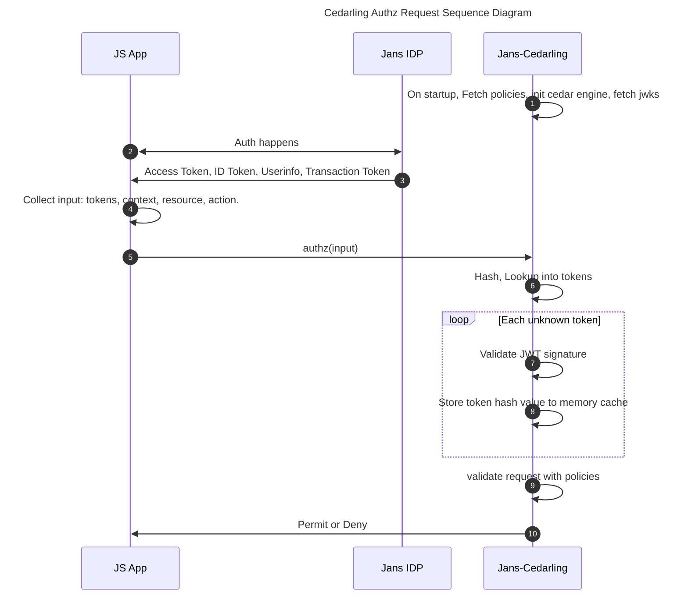

# React Cedarling

In this tutorial, we will guide you to integrate policy base authorizarion in your react application. We are using the [Cedar](https://www.cedarpolicy.com/) Policy Engine and Jans-Cedarling WebAssembly Library.

## Prerequisite

[Jans IDP](https://docs.jans.io): Janssen is a distribution of open source identity components which organizations can use to build a scalable federated authentication and authorization service. `jans-cedarling` uses IDP token endpoint and DCR to validate access token. Jans IDP provides the `LOCK MASTER CONFIGURATION URI` from where it can download policies and implement in your application.

## Authorization Flow

Let's check the sequence diagram to better understand the Cedarling.



## Create a Policy

We have a awesome UI Tool to create policies. It is [Agama-Lab](https://cloud.gluu.org/agama-lab).

## Setup in Vite 5

1. Install `jans-cedarling` lib.

```sh
npm install jans-cedarling
```

2. Install these two dependencies to enable wasm:

```sh
npm i --save-dev vite-plugin-top-level-await vite-plugin-wasm
```

3. Then add those two plugins to your vite config in `vite.config.js`:

```js
import wasm from "vite-plugin-wasm";
import topLevelAwait from "vite-plugin-top-level-await";
import { defineConfig } from "vite";

export default defineConfig({
  plugins: [wasm(), topLevelAwait()],
});
```

4. Load the code:

```js
import("jans-cedarling").then((module) => {
  // cache it globally here or invoke functions like module.init(config);
});
```

## Init

```js
const config = {
  policyStore: {
    // can be "local", "remote" or "lock-master",
    // each strategy requires different parameters, see below
    strategy: "remote",
    url: "https://raw.githubusercontent.com/JanssenProject/jans/main/jans-lock/cedarling/policy-store/default.json",
  },
  // Set of jwt algorithms that the cedarling will allow, empty if omitted
  supportedAlgorithms: ["HS256", "HS384", "RS256"],
};
```

There are 3 strategies:

1. `local`: The "local" strategy is a fallback option. the cedarling will use a statically embedded policy store, located in `/policy-store/default.json`

   ```js
   const local = {
     strategy: "local",
   };
   ```

2. `remote`: the "remote" strategy is only slightly more complex than "local", with the only difference being you provide a http `url` from which a simple GET request is used to acquire the Policy Store.

   ```js
   const remote = {
     strategy: "remote",
     url: "https://raw.githubusercontent.com/JanssenProject/jans/main/jans-lock/cedarling/policy-store/default.json",
   };
   ```

3. `lock-master`: the "lock-master" strategy is a more complicated, authenticated strategy employing OAuth.
   ```js
   const lockMaster = {
     strategy: "lock-master",
     // `url` a http URL to a Jans Lock Master instance
     url: "https://lock.master.gluu.cloud",
     // `policyStoreId` acquire a specific Policy Store from the Lock Master
     policyStoreId: "#83J5KF9U2KAKtO2J",
     // `enableDynamicConfiguration` if the cedarling should subscribe to Policy Updates via the Lock Master's SSE endpoint
     enableDynamicConfiguration: true,
     // `ssaJwt`: Software Statement used by the cedarling during OAuth Dynamic Client registration
     ssaJwt: "...",
   };
   ```
