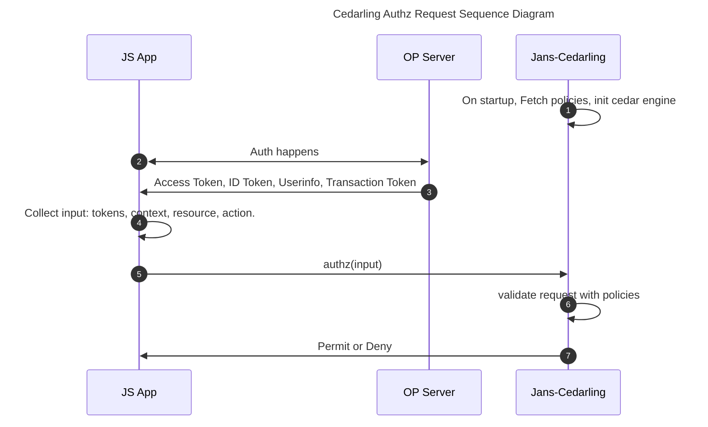

# React Cedarling Role Based Authorization

This article will guide you to integrate RBAC policy base authorizarion using [Jans Cedarling](https://github.com/JanssenProject/jans/blob/main/docs/cedarling/cedarling-overview.md) in your react applications.

Let's start implementing it. In example we will involve multiple roles and conditional policies. We'll define the schema, policies, and evaluate several requests to see how Cedarling makes authorization easy in React with low code.

Use Case: Multi Role Access control in a Project Task Management System

- Principals: Users with roles like `Admin`, `Manager` and `Member`.
- Actions: `Add`, `Update`, `Delete`, and `View`
- Resources: Task

Roles and Permissions:

1. Admin:

   - Can perform any operation

2. Manager:

   - Can perform `Add`, `Update`, `View`
   - Cannot perform `Delete`

3. Member

   - Can perform only `View`

## Prerequisite

- You can use any OpenID Connect Server like [Jans](https://docs.jans.io), Google, Okta.

## Authorization Flow

Let's check the sequence diagram to better understand the Cedarling.



## Create a Policies

We have a awesome UI Policy Designer Tool to create policy store and policies. It is [Agama-Lab](https://cloud.gluu.org/agama-lab). Check Policy Designer Tool Guide [here](https://gluu.org/agama/authorization-policy-designer/) for more information.

- Use [Agama Lab UI Tool](https://cloud.gluu.org/agama-lab) to create policy store.
- Create policy store `JansReactCedarlingRBAC`.
- Add `Task` in Entity Type.
- Go to `Policies > Add Policy > Text Editor`.
- Copy policy one by one and add in text editor.
- Click on `Save` to add policy.

1. Admin can perform any operation on resource.

```js
@id("AdminPerformAnyOperationOnResource")
permit(
  principal in Jans::Role::"admin",
  action,
  resource
);
```

2. Manager can add, update, and view Task.

```js
@id("ManagerCanAddUpdateViewTask")
permit (
  principal in Jans::Role::"manager",
  action in [Jans::Action::"Add",
  Jans::Action::"Update",
  Jans::Action::"View"],
  resource is Jans::Task
);
```

3. Member can only view task.

```js
@id("MemberCanOnlyViewTask")
permit (
  principal in Jans::Role::"member",
  action in [Jans::Action::"View"],
  resource is Jans::Task
);
```

## Installation

Install `jans-cedarling` lib.

```sh
npm install @janssenproject/cedarling_wasm
```

For vite-js, you may need to add extra config.

```js
import { defineConfig } from "vite";

export default defineConfig({
  optimizeDeps: {
    exclude: ["@janssenproject/cedarling_wasm"],
  },
});
```
