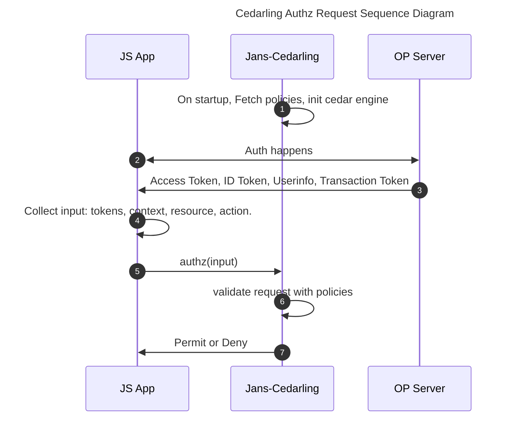

# React Cedarling Role Based Authorization

This article will guide you to integrate **RBAC** policy base authorizarion using [Jans Cedarling](https://github.com/JanssenProject/jans/blob/main/docs/cedarling/cedarling-overview.md) in your react applications.

Let's start implementing it. In example we will involve multiple roles and conditional policies. We'll define the schema, policies, and evaluate several requests to see how Cedarling makes authorization easy in React with low code.

Use Case: Multi Role Access control in a Project Task Management System

- Principals: Users with roles like `Admin`, `Manager` and `Member`.
- Actions: `Add`, `Update`, `Delete`, and `View`
- Resources: Task

Roles and Permissions:

1. Admin:

   - Can perform any operation

2. Manager:

   - Can perform `Add`, `Update`, `View`
   - Cannot perform `Delete`

3. Member

   - Can perform only `View`

## Prerequisite

- You can use any OpenID Connect Server like [Jans](https://docs.jans.io), Google, Okta.

## Authorization Flow

Let's check the sequence diagram to better understand the Cedarling. `Jans-Cedarling` is library which we will use for policy authorization. which is part of your JS App.



## Create a Policies

We have a awesome UI Policy Designer Tool to create policy store and policies. It is [Agama-Lab](https://cloud.gluu.org/agama-lab). Check Policy Designer Tool Guide [here](https://gluu.org/agama/authorization-policy-designer/) for more information.

- Use [Agama Lab UI Tool](https://cloud.gluu.org/agama-lab) to create policy store.
- Create policy store `JansReactCedarlingRBAC`.
- Add `Task` in Entity Type.
  
- Add `Add` Action, set `Principal: User` and `Resources: Task`. Like wise add other actions `Update`, `Delete`, `View`.
  
- Go to `Policies > Add Policy > Text Editor`.
- Copy policy one by one and add in text editor.
- Click on `Save` to add policy.

1. Admin can perform any operation on resource.

```js
@id("AdminPerformAnyOperationOnResource")
permit(
  principal in Jans::Role::"admin",
  action,
  resource
);
```

2. Manager can add, update, and view Task.

```js
@id("ManagerCanAddUpdateViewTask")
permit (
  principal in Jans::Role::"manager",
  action in [Jans::Action::"Add",
  Jans::Action::"Update",
  Jans::Action::"View"],
  resource is Jans::Task
);
```

3. Member can only view task.

```js
@id("MemberCanOnlyViewTask")
permit (
  principal in Jans::Role::"member",
  action in [Jans::Action::"View"],
  resource is Jans::Task
);
```

## Installation

Install `jans-cedarling` lib into your React JS Application

```sh
npm install @janssenproject/cedarling_wasm
```

For vite-js, you may need to add extra config.

```js
import { defineConfig } from "vite";

export default defineConfig({
  optimizeDeps: {
    exclude: ["@janssenproject/cedarling_wasm"],
  },
});
```

## Configure Cedarling Bootstrap

You need to first initialize Cedarling WASM object. For that Cedarling WASM needs some properties. Configure it like below:

```js
export const cedarlingBootstrapProperties = {
  CEDARLING_APPLICATION_NAME: "AgamaLab",
  CEDARLING_POLICY_STORE_URI: "<your_policy_store_URI>",
  CEDARLING_POLICY_STORE_ID: "<your_policy_store_id>",
  CEDARLING_USER_AUTHZ: "enabled",
  CEDARLING_WORKLOAD_AUTHZ: "disabled",
  CEDARLING_LOG_TYPE: "std_out",
  CEDARLING_LOG_LEVEL: "TRACE",
  CEDARLING_LOG_TTL: 120,
  CEDARLING_PRINCIPAL_BOOLEAN_OPERATION: {
    "===": [{ var: "Jans::User" }, "ALLOW"],
  },
};
```

## Create a CedarlingClient Class

This class implements a singleton pattern for managing Cedar authorization using WebAssembly (WASM), providing a centralized way to initialize the Cedar policy engine and perform authorization checks. It wraps the `@janssenproject/cedarling_wasm` module to handle policy evaluation through a single, reusable instance that can be accessed throughout the application.

```ts
class CedarlingClient {
  private static instance: CedarlingClient;
  private cedarling: Cedarling | null = null;
  private initialized = false;
  private wasmModule: any = null;

  private constructor() {}

  static getInstance(): CedarlingClient {
    if (!CedarlingClient.instance) {
      CedarlingClient.instance = new CedarlingClient();
    }
    return CedarlingClient.instance;
  }

  async initialize(policyStoreConfig: any): Promise<void> {
    if (!this.initialized) {
      this.wasmModule = await initWasm();
      console.log("WASM initialized", this.wasmModule);
      this.cedarling = (await init(policyStoreConfig)) as unknown as Cedarling;
      this.initialized = true;
    }
  }

  async authorize(request: any): Promise<AuthorizeResult> {
    if (!this.cedarling || !this.initialized) {
      throw new Error("Cedarling not initialized");
    }
    try {
      const result = await this.cedarling.authorize(request);
      return result;
    } catch (error) {
      console.error("Error during authorization:", error);
      throw error;
    }
  }
}

export const cedarlingClient = CedarlingClient.getInstance();
```

## Initialize Cedarling

We are globally initializing cedarling object. You can add it in your app started files. Like in ViteJS case, you can add it in `App.tsx` and In Next JS case, you can add it in `src/layout.tsx`.

```js
useEffect(() => {
  cedarlingClient.initialize(cedarlingBootstrapProperties).catch(console.error);
}, []);
```

## Create a React hook

This Reack hook provides authorization functionality using the Cedarling client, with the ability to enforce authorization checks when enabled through environment variables. The hook manages loading and error states while processing authorization requests, and returns a boolean or AuthorizeResult indicating whether the authorization was successful.

```js
import { useCallback, useState } from "react";
import { cedarlingClient } from "./cedarlingUtils";
import { parseJwt } from "./parseJWT";
import { AuthorizeResult } from "@janssenproject/cedarling_wasm";

export function useCedarling() {
  const [isLoading, setIsLoading] = useState(false);
  const [error, setError] = useState<Error | null>(null);
  const authorize = useCallback(
    async (request: any): Promise<AuthorizeResult> => {
      setIsLoading(true);
      setError(null);
      try {
        // Log only for debug purpose
        console.log("Enforcing Cedarling authorization");
        console.log("Request: ", request);
        console.log("Decoded idToken: ", parseJwt(request.tokens.id_token as string));
        console.log("Decoded accessToken: ",parseJwt(request.tokens.access_token as string));
        // userinfo token case
        // console.log('Decoded userInfo: ', parseJwt(request.tokens.userinfo_token as string))
        return await cedarlingClient.authorize(request);
      } catch (err) {
        const error = err instanceof Error ? err : new Error("Authorization failed");
        setError(error);
        throw error;
      } finally {
        setIsLoading(false);
      }
    },
    []
  );
  return { authorize, isLoading, error };
}
```

## Protect Actions and Components

Let's use above tool to protect elements. Your ID Token should have `role` claim. it can be one value like `role: admin` or array like `role: ["admin", "manager"]`, both are valid. Check [Cedarling entities document](https://github.com/JanssenProject/jans/blob/main/docs/cedarling/cedarling-entities.md#role-entity) for more details about role entity creation and usage.

Below is example of Task React Page:

```js
import { useCedarling } from "@/factories/useCedarling";
import { AuthorizeResult } from "@janssenproject/cedarling_wasm";

export default function TasksPage() {
  const { authorize } = useCedarling();

  const cedarlingRequest = async (action: string) => {
    const idToken = "<your_id_token>";
    const accessToken = "<your_access_token>";

    const request = {
      tokens: {
        access_token: accessToken,
        id_token: idToken,
      },
      action: `Jans::Action::"${action}"`,
      resource: {
        type: "Jans::Task",
        id: "App",
        app_id: "App",
        name: "App",
        url: {
          host: "jans.test",
          path: "/",
          protocol: "http",
        },
      },
      context: {},
    };

    const result: AuthorizeResult = await authorize(request);
    return result;
  };

  const handleAdd = async () => {
    try {
      const result = await cedarlingRequest("Add");
      console.log(result);
      if (result.decision) {
        alert("Successfully added!");
      } else {
        alert("You are not allowed to add new Task!");
      }
    } catch (e) {
      alert("You are not allowed to add new Task!");
      console.log(e);
    }
  };
}

<button className="btn btn-primary mb-3" onClick={handleAdd}>
  <FaPlus className="me-2" />
  Add Task
</button>;
```

In above example there are 2 things:

- First, we make a function `cedarlingRequest` which accept action and help us to make an authorization requrest to Cedarling WASM with Access Token and ID Token. Your ID Token should have Role claim and if you don't have role then you need to change policy which will be act like ABAC.

- Second, we have `handleAdd` function where it help us to request and check auth for `Add` operation. In response, it return result where we get which policy is responsible for authorization, timestamp, and dicision. Below is the example of result. Use `result.decision` to authorize request and show/hide elements.

```json
{
  "id": "0195d7d5-cde9-7777-86eb-98b5ed415ffc",
  "request_id": "0195d7d5-cde6-730e-846e-0797827c03ba",
  "timestamp": "2025-03-27T19:11:08.201Z",
  "log_kind": "Decision",
  "policystore_id": "87d2c8877a2455a16149c55d956565e1d18ac81ba10a",
  "policystore_version": "undefined",
  "principal": ["User"],
  "User": {},
  "diagnostics": {
    "reason": [
      {
        "id": "6b51f8244fe1fc3b273733f9d93def7f07080367fbc1",
        "description": "ManagerReadShareApp"
      }
    ],
    "errors": []
  },
  "action": "Jans::Action::\"Read\"",
  "resource": "Jans::Application::\"App\"",
  "decision": "DENY",
  "tokens": {
    "id_token": {
      "jti": "IXV9GbiQTI6HD2atsQEkVQ"
    },
    "access_token": {
      "jti": "7PDlytNLSicUdrsn7v8dcA"
    }
  },
  "decision_time_micro_sec": 3000,
  "pdp_id": "bbc580e1-04c0-495d-9d2a-d3f5e9411285",
  "application_id": "AgamaLab"
}
```
