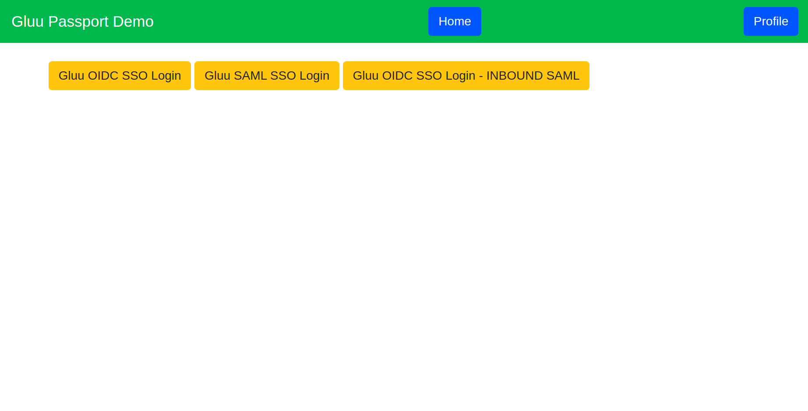

# Nodejs Passport

Nodejs demo application secure by the OpenID Connect and SAML Security. I am using `passport-js` and `Gluu Server` as a OpenID Connect Provider. 
[Check wiki pages](https://github.com/kdhttps/node-passport/wiki) for all the flow details, implementation and integration with Gluu Server.



# Prerequisite

* node js >= 10.x.x
* npm >= 6.x.x
* [Gluu CE](https://gluu.org)


## Installation and Run

 1. Clone the repository and move to cloned directory and hit:

    ```npm install```

    This will install all the dependencies for the project.

 2. To start the project hit:  

    ```
    node index.js
    ```
    or
    ```
    npm start
    ```

## Configuration

[Check wiki pages](https://github.com/kdhttps/node-passport/wiki) for all the flow details, implementation and integration with Gluu Server.