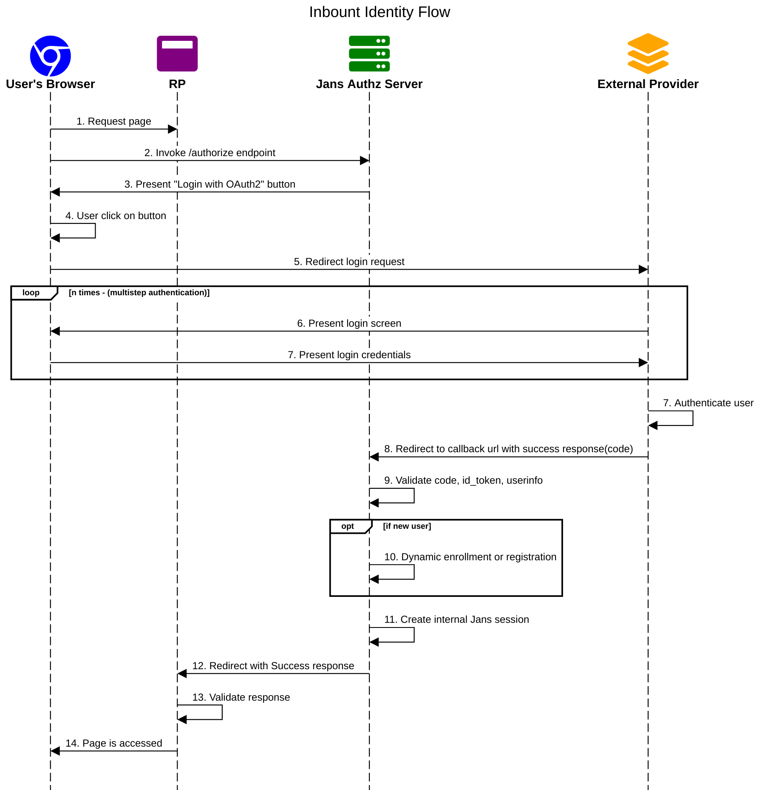

# Inbound external oauth2 server authentication for Jans server

In this tutorials, we will see how you can integrate inbound external oauth2 server authentication in jans server. If you are looking for social login support then checkout [passport](https://github.com/GluuFederation/tutorials/blob/master/oidc-sso-tutorials/code/node/jans-passport/README.md) module for that.

We will use [interception authentication script](https://github.com/GluuFederation/tutorials/blob/master/oidc-sso-tutorials/code/script/oidc-inbound-script/oidc-jans-script.py) for whole flow. Currently It supports `Authorization Code Flow` and `client_secret_post` token endpoint auth method.  

## What is Inbound identity?

You can add any external OAuth2 server login and authenticated users to your Janssen server.


[Balsamiq Mockup source file is here](https://github.com/GluuFederation/tutorials/blob/master/oidc-sso-tutorials/code/node/jans-passport/files/jans.bmpr)

# Prerequisites

- A Jans-auth Server (installation instructions [here](https://github.com/JanssenProject/jans/tree/main/jans-linux-setup#readme))
- The [external oauth2 server authentication script](https://github.com/GluuFederation/tutorials/blob/master/oidc-sso-tutorials/code/script/oidc-inbound-script/oidc-jans-script.py)
- External OAuth2 Provider credentials: you can choose any external OP server who follows OAuth2 standards and authentication features.  
- RP application: This is your application that will be used by your users and where you want to add this auth feature.

## Sample Authentication Flow diagram



[sequencediagram.org source file is here](files/jans-sequence-flow.txt)

# Configure jans server

1. [Download script from here.](https://github.com/GluuFederation/tutorials/blob/master/oidc-sso-tutorials/code/script/oidc-inbound-script/oidc-jans-script.py)

2. This script need accept one property `oidc_creds_file`. which is json file with your external oauth2 server details

```
// oidc_creds_file: /opt/oidc.json
{
  "op_server": "https://your.external.oauth2.server",
  "client_id": "xxxxxxxxxxxxxxxx-xxxxx-external-oauth2",
  "client_secret": "xxxxxxxxxxxxxx-xxxxx-external-oauth2",
  "authorization_uri": "https://your.external.oauth2.server/xx/xxxx",
  "token_uri": "https://your.external.oauth2.server/oauth/xx/xxx",
  "userinfo_uri": "https://your.external.oauth2.server/xxx/xxx",
  "redirect_uri": "https://your.jans.server/jans-auth/postlogin.htm",
  "scope": "openid profile email",
  "auto_redirect": false,
  "title": "Login with OAuth2"
}
```

| Property | Description |
|----------|-------------|
| op_server | Your external OAuth2 server FQDN |
| client_id | Client id of your external OAuth2 server |
| client_secret | Client secret of your external OAuth2 server |
| authorization_uri | Authorization endpoint of your external OAuth2 server |
| token_uri | Token endpoint of your external OAuth2 server |
| userinfo_uri | Userinfo endpoint of your external OAuth2 server |
| redirect_uri | Sample: `https://<your.jans.server>/jans-auth/postlogin.htm`, This is redirect URL where your OAuth2 server redirect back with `code`. Use this same URL to configure `redirect urls` at your external OAuth2 server.|
| scope | OAuth scopes |
| auto_redirect | If true, it will automatically redirect to external OAuth2 server otherwise you will get one button on jans login page. |
| title | This property is use to set text for button which shown on jans login page |

3. Download [oidc-jans-login.xhtml from here](https://github.com/GluuFederation/tutorials/blob/master/oidc-sso-tutorials/code/script/oidc-inbound-script/oidc-jans-login.xhtml) and place it here `/opt/jans/jetty/jans-auth/custom/pages/auth/oidc/oidc.xhtml`. Rename it to `oidc.xhtml`.

4. Follow [these instructions](https://github.com/JanssenProject/jans-cli/blob/main/docs/cli/cli-default-authentication-method.md) to add [script](https://github.com/GluuFederation/tutorials/blob/master/oidc-sso-tutorials/code/script/oidc-inbound-script/oidc-jans-script.py) in jans server. In name field you can add `oidc`. This name will be your acr value.

5. Restart jans-auth server `service jans-auth restart`

## Testing at RP application

RP(Relying party) is application which will be used by your users where you want to add authentication and protect resources. Once you intiate auth request from your RP Application make sure to add `acr_values=oidc` in request. acr_values is your script name as configured above.

You can use [`OIDC Authorization Code Flow`](https://github.com/GluuFederation/tutorials/blob/master/oidc-sso-tutorials/tutorials/OpenID-Connect-OAuth2-SSO-with-Gluu.md) to initiate auth request to janssen server. For testing you can use [node-gluu-sso](https://github.com/GluuFederation/tutorials/tree/master/oidc-sso-tutorials/code/node/node-gluu-sso) as a RP application for quick testing.

